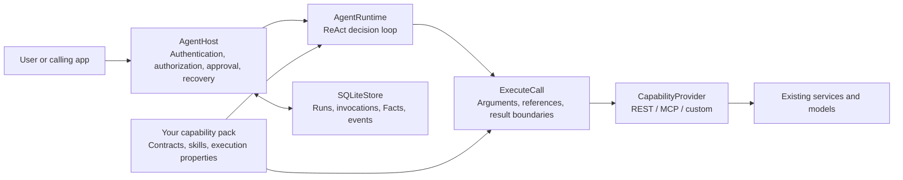

# Agenstra

Language / 语言: [简体中文](README.zh-CN.md) · **English**

Agenstra is a general-purpose agent framework written in Go that you can deploy independently. Bring existing REST APIs, selected OpenAPI operations, MCP tools, or custom SDK integrations into the agent as **reviewed capability packs**. The framework handles ReAct decisions, tool-call boundaries, per-user authorization, approvals, result provenance, and resumable long-running tasks. The connected services remain responsible for their own data and computations.

An optional management interface lets administrators validate, publish, activate, and roll back capability packs through a CLI or web page, then configure user connections and grants. Managed releases are fixed by content hash: new runs use the active release, while existing managed runs keep the release they started with. Authorization and connection identity are still checked at execution time.

Optional web integration adds headless chat and conversation APIs, a framework-independent JavaScript SDK, a conversation queue, and a browser control bridge. The framework owns agent context and checkpoint recovery; hosts select a conversation by ID and supply their own chat UI, authenticated identity, business APIs, page observations, and UI handlers. Authorization, approvals and receipts reuse the existing runtime. See the [Web integration guide (Chinese)](docs/web-integration.md), or run `go run ./examples/web-integration` for a local demo without a model key.

Built-in scheduled tasks support one-time timestamps, fixed intervals, and five-field Cron with IANA timezones. Hosts manage schedules through public Go methods or authenticated `/schedules` HTTP APIs, and follow each execution through the existing run APIs. Definitions and history survive restarts; triggering rechecks authorization and preserves approvals. See the [scheduled task integration guide (Chinese)](docs/scheduled-tasks.md).

For an existing frontend/backend application, follow the [host integration checklist and lottery reference (Chinese)](docs/host-integration.md). Export the headless client with `node web/export-client.mjs /path/to/host/vendor/agenstra`; the export includes TypeScript declarations and SHA-256 provenance, with no UI or npm runtime dependency.

Agenstra can serve a personal tool, a team application, or a larger system. This repository contains the framework, generic tests, deployment templates, guides, and a clearly labeled local demo. **It does not include production business packs, an external model, or credentials.** `deploy/deployment.example.json` is a template; starting it unchanged will not create an agent with working capabilities.

## Scope and architecture

Suppose an application already has search, data-transformation, and notification APIs. Once these are declared as capabilities, the agent can search, read actual fields from the returned Fact, call the transformation API, and send a notification if the task calls for one. Agenstra does not hard-code that workflow. The integrator chooses capability boundaries, usage guidance, and authorization policy.

The current durable host targets **one node with persistent local storage and SQLite WAL**. A deployment can serve multiple users with separate connections and capability grants. Distributed high availability, automatic retention cleanup, model quality, and the correctness of external computations require separate design or validation.



| Component | Responsibility |
| --- | --- |
| `AgentRuntime` | Chooses one next action from the task, capability catalog, skills, and observed Facts: call tools, read a skill, inspect a result, ask for input, or answer. There is no fixed domain DAG or separate planning mode. |
| `AgentHost` | Persists user-scoped runs and pre-call records; manages approvals, leases, timeouts, background-job polling, recovery, and cancellation. |
| `ExecuteCall` | Validates capability calls and grants; the runtime records verified results as Facts with provenance. |
| `CapabilityProvider` | Presents one interface for capabilities, skills, invocation, and results. REST and MCP connectors are built in; applications can provide their own. |
| Capability pack | Declares exposed capabilities, input/output contracts, guidance, effects, idempotency, and background-job mappings. The integrator reviews and deploys it. |
| `CapabilityRegistry` | Optionally stores validated immutable releases, the active release, user connections, and a management audit trail. |

See the [architecture guide (Chinese)](docs/architecture.md) for the execution and security boundaries.

## Connect existing capabilities

1. Select the APIs you already operate. Write an `agenstra.rest-pack.v2` manifest for REST, import only named `operationId` values from an OpenAPI 3.0/3.1 JSON document, or pin reviewed MCP tool contracts by hash.
2. Review each capability's `effect` (`read`, `compute`, `write`, or `destructive`), JSON Schema, credential binding, idempotency, approval requirement, and long-running operation states. Importers produce drafts; they do not infer access rights.
3. Optionally add skill files explaining units, prerequisites, exceptional cases, and how to interpret results. The manifest records each file's SHA-256. A skill provides guidance, never permission.
4. Configure pack paths, per-user capability grants, credential environment-variable references, and whether external data may be sent to the model. Run the same framework code with your configuration.
5. Validate representative tasks against the real model and services, including authorization, error paths, API contracts, and answer quality.

For a complete REST example, see the [integration tutorial (Chinese)](docs/tutorial.md). The [deployment guide (Chinese)](docs/deployment.md) covers production configuration, Docker Compose, HTTP status handling, and operations. To manage releases and grants without restarting the service, follow the [capability management guide (Chinese)](docs/capability-management.md).

## Quick start

You need Go 1.26+. From the repository root:

```sh
git clone https://github.com/KHG420/agenstra.git
cd agenstra
go mod download
CGO_ENABLED=0 go build -trimpath -o dist/ ./cmd/...
```

The build produces four standalone commands in `dist/`. SQLite storage and JSON Schema validation use pure Go libraries; the server embeds the management page and its static assets.

| Command | Purpose |
| --- | --- |
| `agenstra` | Inspect a capability catalog or execute a local task. |
| `agenstra-serve` | Serve the HTTP API, durable worker, and optional management interface. |
| `agenstra-manage` | Validate, publish, and manage capability releases and grants through the management API. |
| `agenstra-import-openapi` | Create a REST pack draft from selected OpenAPI operations. |

REST and MCP support are included in the Go binaries. Create your own pack using the integration tutorial and provide the environment variables referenced by its manifest. You can then inspect its catalog without calling an LLM:

```sh
go run ./cmd/agenstra \
  --pack local/packs/records/pack.json --inspect
```

`local/packs/records/pack.json` is a path you create; it is not in this repository. Serving runs also requires:

- `AGENT_MODEL`: the model name.
- `AGENT_MODEL_BASE_URL`: the model gateway base URL, such as `https://gateway.example/v1`; the adapter calls its `/chat/completions` endpoint.
- `AGENT_MODEL_API_KEY`: the model gateway credential.
- The user API keys, external service addresses, and credentials referenced by your deployment configuration.

The default model adapter asks `/chat/completions` for a JSON-object decision using `response_format: {"type":"json_object"}`. The model must actually support this protocol. To use another model interface, implement `DecisionModel`. Once you have created `local/deployment.json`, start the host:

```sh
go run ./cmd/agenstra-serve \
  --config local/deployment.json
```

To use the compiled server, run `./dist/agenstra-serve --config local/deployment.json`. Container build and persistent-storage configuration are covered in the [deployment guide (Chinese)](docs/deployment.md).

The default listener is `127.0.0.1:8091`. `GET /readyz` checks database and worker readiness. `POST /runs` creates a run; the worker executes it and wakes runs that are waiting:

```sh
curl -sS http://127.0.0.1:8091/runs \
  -H "Authorization: Bearer $AGENT_OPERATOR_API_KEY" \
  -H 'Content-Type: application/json' \
  -d '{"pack_id":"records","instruction":"Look up record R-1 and explain its status","request_id":"record-R-1-001"}'
```

For one user, the same `request_id` and request content return the same run; reusing the ID with different content conflicts. The response includes `run_id`, `status`, and `revision`. Follow progress with `GET /runs/{run_id}` and retrieve a complete result with `GET /runs/{run_id}/artifacts/{fact_id}`. See the [deployment guide (Chinese)](docs/deployment.md) for status and approval examples.

## Manage capabilities while running (optional)

Enable `management` in the deployment configuration and set a separate `AGENSTRA_ADMIN_API_KEY` to use `/admin` or the CLI backed by the same management API. These commands require a running host and a capability manifest you created. The CLI defaults to `http://127.0.0.1:8091`:

```sh
go run ./cmd/agenstra-manage validate local/packs/records/pack.json
go run ./cmd/agenstra-manage publish local/packs/records/pack.json
go run ./cmd/agenstra-manage list
```

Publishing neither activates a release nor grants access. Read the full content digest and current revision from `list`, explicitly activate the release, then bind a user connection and capability grants. Activating an older release rolls back new runs; revoking a grant affects existing runs immediately. Connection records contain environment-variable or `secret:NAME` references, not plaintext secret values. Configuration, activation, rollback, connection checks, and backup requirements are documented in the [capability management guide (Chinese)](docs/capability-management.md).

Web and CLI also share saved REST/MCP drafts: configure one section at a time, append selected OpenAPI operations or package capabilities with explicit conflict handling, and publish after validation. Use `agenstra-manage draft` for the command list; the [draft workflow and examples (Chinese)](docs/capability-management.md#6-分步编辑共享草稿) cover save/resume, export, and revision conflicts.

## Supported capability sources

| Source | Built-in integration | Review still required |
| --- | --- | --- |
| JSON REST API | GET/POST/PUT/PATCH/DELETE; path, query, header, and body bindings; nested JSON Schema, response-status contracts, and service error codes. | Endpoints, authentication, `effect`, retry/idempotency, and result meaning. |
| OpenAPI 3.0/3.1 JSON | Selected `operationId` values become a REST v2 draft; local schema references and an explicit bearer-token environment variable are supported. | Generated contracts, unsupported serialization/authentication, skills, approvals, and background-job mappings. |
| MCP | stdio and streamable HTTP; paginated discovery, selected tools, input/output validation, and reviewed contract hashes. | Commands/endpoints, tool effects, reference lifetimes, idempotency, and grants. |
| Custom SDK | Implement `CapabilityProvider` and supply a user-scoped connection factory from your application. | Identity isolation, input/output validation, and execution guarantees. |

Example OpenAPI import (replace paths and `operationId` with your own):

```sh
go run ./cmd/agenstra-import-openapi \
  --spec local/openapi.json \
  --out local/packs/records/pack.json \
  --name records \
  --base-url-env RECORDS_API_URL \
  --token-env RECORDS_API_TOKEN \
  --operation records.get
```

The importer **does not** infer approvals, idempotency, or background-job completion from an operation name. Review and complete declarations for writes and long-running tasks using the [integration tutorial (Chinese)](docs/tutorial.md).

## Execution guarantees and limits

- Before an external call, the host persists its invocation ID, exact arguments, and hash. After an uncertain outcome, it can replay only a capability declared safe or backed by real upstream idempotency. Other calls enter `needs_reconciliation` so the integrator can check the external system.
- An approval applies to a specific user, invocation, and argument hash. Identity, grants, and leases are checked again before submission; skill text cannot bypass them.
- Complete tool results are stored separately as Facts with provenance. The model sees a bounded preview and may inspect the full result by path. A Fact ID identifies local evidence, not an external resource.
- For an `OperationBinding`, the host saves the external job receipt and polls the status capability. An HTTP success or `queued` response does not mean the job has finished.
- Runs, events, Facts, and continuation APIs are scoped by `owner_id`. A deployment may configure multiple users with different capability sets.

Cancellation stops local orchestration; it does not promise to cancel a job already submitted upstream. SQLite WAL fits the current single-node scope. Use persistent storage and define backup and retention policies.

## Migrating from the Python version

The Go version retains the deployment JSON format, capability manifests, HTTP routes and response formats, and SQLite v1 run schema. Compatibility tests cover reading and continuing runs created by the Python version, including stored Facts, request IDs, and REST contract fingerprints.

Back up the database, stop the Python worker, and start the Go server using the same deployment configuration and persistent database paths. Update launch commands to the Go commands above. Custom Python `CapabilityProvider` and `DecisionModel` implementations need to be ported to the corresponding Go interfaces.

## Development and validation

```sh
go test -race ./...
go vet ./...
go build ./cmd/...
```

The tests generate temporary REST/MCP contracts, model doubles, and SQLite databases. They need no domain pack or live external service. Before production use, validate real identities, model decisions, API contracts, long-running tasks, and operating conditions in the target environment. Current trade-offs and pre-launch checks are in the [architecture guide (Chinese)](docs/architecture.md) and [deployment guide (Chinese)](docs/deployment.md).
