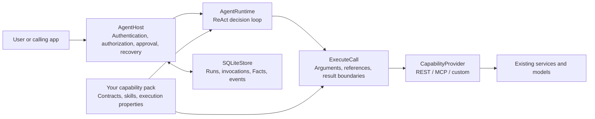

# Agenstra

[Quick integration: service, optional chat UI, MCP discovery and acceptance (Chinese)](docs/quick-integration.md)

Language / 语言: [简体中文](README.zh-CN.md) · **English**

**Make it easier to add an agent to the systems you already run.**

Agenstra is an agent framework written in Go for integration with existing applications. It provides decisions, tool calls, conversation context, authorization, approvals, and task recovery so your application can offer a natural-language task interface. Your existing APIs, SDKs, and page actions perform the actual work, connected through REST, OpenAPI, MCP, or a custom adapter.

**You mainly add capability declarations, usage guidance, connection and grant configuration, and small adapters where needed; the framework supplies the agent runtime.** Business rules continue to use your application's existing implementation, and the chat interface can follow its existing design.

Start with the [minimal REST integration tutorial (Chinese)](docs/tutorial.md), or follow the [existing application integration checklist (Chinese)](docs/host-integration.md) to connect a frontend/backend application.

## What you need to add

| Integration area | What you add | What the framework provides |
| --- | --- | --- |
| Existing business APIs | Declare selected APIs in a capability pack with inputs, outputs, effects, and approval requirements; import a draft from OpenAPI when available. | Capability catalogs, ReAct decisions, tool calls, argument validation, and result provenance. |
| Domain knowledge | Add guidance or skill files as needed to explain prerequisites, units, and result meaning. | Skill reading, context assembly, and references to observed results. |
| Users and deployment | Configure the model, persistent storage, user connections, and capability grants; integrate the host's verified login identity. | User-scoped runs, authorization checks before calls, approvals, background-job polling, and recovery. |
| Chat and page actions (optional) | Connect your own chat UI; for page control, also declare frontend actions, supply page observations, and write handlers that call existing functions or APIs. | A headless JavaScript SDK, conversation history and context, message queues, action delivery, and receipt recovery. |

For REST or MCP interfaces supported by the built-in connectors, integration is mostly declarations and configuration. Add a handler or `CapabilityProvider` adapter when you need to operate an existing page or call a specialized SDK. For backend capabilities alone, use the HTTP API directly without enabling the browser control bridge.

For example, an order application already has an order-query API and a function that opens an order detail page. Declare the API as a capability and the page operation as a frontend action whose handler calls the existing function. When a user asks to "find pending orders and open order 1001," Agenstra selects capabilities, passes arguments, requests approval as configured, and waits for results. Queries, business permission checks, and navigation still use the application's existing implementation.

## Start with an existing operation

1. **Choose one operation.** Connect a well-defined query or action using its existing API and business rules, then add capabilities incrementally.
2. **Describe how to use it.** Write an `agenstra.rest-pack.v2` manifest or import selected `operationId` values from OpenAPI 3.0/3.1 JSON; for MCP, pin selected tool contracts by hash. Review inputs, outputs, effects, credential bindings, idempotency, approvals, and long-running operation states. Add skill files as needed and record their SHA-256 hashes.
3. **Bind runtime configuration.** Set pack paths, the model connection, a persistent database, per-user grants, and credential references. Explicitly decide whether external data may be sent to the model.
4. **Connect the task interface.** Start the framework service and submit tasks through the HTTP API. For chat, connect the JS SDK and your UI; for page control, also register frontend actions and handlers. The framework manages conversation context and run checkpoints; the host selects conversations by ID.
5. **Validate real tasks.** Check capability selection, permissions, approvals, error paths, and result quality against the real model and APIs. Add further business capabilities through the same packs and adapter interfaces.

See the [REST tutorial (Chinese)](docs/tutorial.md) and [Web integration guide (Chinese)](docs/web-integration.md) for complete examples. Export the SDK with `node sdk/web/export-client.mjs /path/to/host/vendor/agenstra` to pin JavaScript, TypeScript declarations, and SHA-256 records in the host, with no npm runtime dependency.

## Try the integration locally

With Go 1.26+, run this from the repository root:

```sh
go run ./examples/web-integration
```

Open `http://127.0.0.1:8092` and send "查询待处理订单并显示列表" or "打开订单 1001". The example connects a backend API and page actions using demo data and a fixed `DecisionModel`, so no model key is required. Its chat UI belongs to the demo application; use your own UI, identities, business APIs, and model for an actual integration. See the [example README (Chinese)](examples/web-integration/README.md).

## Architecture and operating scope

Agenstra can run as an independent service accessed through HTTP APIs; Go applications can also integrate through its public interfaces. The integrator chooses capability boundaries, usage guidance, and authorization policy. The runtime selects each next action from the task and observed results.

The current durable host targets **one node with persistent local storage and SQLite WAL**. A deployment can serve multiple users with separate connections and capability grants. One project owns one pack; a durable task can explicitly compose authorized capabilities from other projects using verified per-user connections and restricted task scopes. See [cross-project tasks](docs/cross-project-tasks.md). All capabilities, including reads, require explicit grants. Distributed high availability, automatic retention cleanup, model quality, and the correctness of external computations require separate design or validation.

This repository contains the framework, generic tests, deployment templates, guides, and a local demo. Production use requires your own business packs, model connection, and credentials; `deploy/deployment.example.json` is a configuration template.

Go applications import `github.com/KHG420/agenstra/sdk/go` (package `agenstra`). The source tree follows a kernel and SDK layout: execution and persistence live in `internal/runtime/engine`, independent helpers are grouped under `internal/base`, `contract`, `ext`, and `platform`, the developer console assets live in `internal/frontend/admin`, and browser integration lives in `sdk/web`. Commands and examples use the same Go SDK. See the [source module map](docs/architecture.md#源码模块与依赖方向).



| Component | Responsibility |
| --- | --- |
| `AgentRuntime` | Chooses one next action from the task, capability catalog, skills, and observed Facts: call tools, read a skill, inspect a result, ask for input, or answer. There is no fixed domain DAG or separate planning mode. |
| `AgentHost` | Persists user-scoped runs and pre-call records; manages approvals, leases, timeouts, background-job polling, recovery, and cancellation. |
| `ExecuteCall` | Validates capability calls and grants; the runtime records verified results as Facts with provenance. |
| `CapabilityProvider` | Presents one interface for capabilities, skills, invocation, and results. REST and MCP connectors are built in; applications can provide their own. |
| Capability pack | Declares exposed capabilities, input/output contracts, guidance, effects, idempotency, and background-job mappings. The integrator reviews and deploys it. |
| `CapabilityRegistry` | Optionally stores validated immutable releases, the active release, user connections, and a management audit trail. |

See the [architecture guide (Chinese)](docs/architecture.md) for the execution and security boundaries.

## Quick start

You need Go 1.26+. From the repository root:

```sh
git clone https://github.com/KHG420/agenstra.git
cd agenstra
go mod download
CGO_ENABLED=0 go build -trimpath -o dist/ ./cmd/...
```

The build produces five standalone commands in `dist/`. SQLite storage and JSON Schema validation use pure Go libraries; the server embeds the management page and its static assets.

| Command | Purpose |
| --- | --- |
| `agenstra` | Inspect a capability catalog or execute a local task. |
| `agenstra-serve` | Serve the HTTP API, durable worker, and optional management interface. |
| `agenstra-manage` | Validate, publish, and manage capability releases and grants through the management API. |
| `agenstra-import-openapi` | Create a REST pack draft from selected OpenAPI operations. |
| `agenstra-evaluate` | Run representative HTTP tasks and verify their status, tool use, and business evidence. |

REST and MCP support are included in the Go binaries. Create your own pack using the integration tutorial and provide the environment variables referenced by its manifest. You can then inspect its catalog without calling an LLM:

```sh
go run ./cmd/agenstra \
  --pack local/packs/records/pack.json --inspect
```

`local/packs/records/pack.json` is a path you create; it is not in this repository. Without a `models` catalog, serving runs requires:

- `AGENT_MODEL`: the model name.
- `AGENT_MODEL_BASE_URL`: the model gateway base URL, such as `https://gateway.example/v1`; the adapter calls its `/chat/completions` endpoint.
- `AGENT_MODEL_API_KEY`: the model gateway credential.
- The user API keys, external service addresses, and credentials referenced by your deployment configuration.

To configure multiple model connections and select separate parameters for decisions and memory extraction, use the management console, API, or CLI described in [model selection (Chinese)](docs/model-selection.md). New runs pin their selected configuration; changes apply to future runs.

The default model adapter asks `/chat/completions` for a JSON-object decision using `response_format: {"type":"json_object"}`. The model must actually support this protocol. To use another model interface, implement `DecisionModel`. Once you have created `local/deployment.json`, start the host:

```sh
go run ./cmd/agenstra-serve \
  --config local/deployment.json
```

To use the compiled server, run `./dist/agenstra-serve --config local/deployment.json`. Container build and persistent-storage configuration are covered in the [deployment guide (Chinese)](docs/deployment.md).

The default listener is `127.0.0.1:8091`. `GET /readyz` checks database and worker readiness. `POST /runs` creates a run; the worker executes it and wakes runs that are waiting:

```sh
curl -sS http://127.0.0.1:8091/runs \
  -H "Authorization: Bearer $AGENT_OPERATOR_API_KEY" \
  -H 'Content-Type: application/json' \
  -d '{"pack_id":"records","instruction":"Look up record R-1 and explain its status","request_id":"record-R-1-001"}'
```

For one user, the same `request_id` and request content return the same run; reusing the ID with different content conflicts. The response includes `run_id`, `status`, and `revision`. Follow progress with `GET /runs/{run_id}` and retrieve a complete result with `GET /runs/{run_id}/artifacts/{fact_id}`. See the [deployment guide (Chinese)](docs/deployment.md) for status and approval examples.

## Use built-in capabilities as needed

Start with capability packs and the run API, then enable modules to match your application's needs.

| Capability | What it provides | Integration guide |
| --- | --- | --- |
| Web integration | Headless chat and conversation APIs, framework-managed context, message queues, a JS SDK, and optional browser control. | [Web integration (Chinese)](docs/web-integration.md) |
| Scheduled tasks | One-time timestamps, fixed intervals, and five-field Cron with IANA timezones; persistent definitions and history, with authorization rechecked at trigger time. | [Scheduled tasks (Chinese)](docs/scheduled-tasks.md) |
| Memory | Preferences, lasting constraints, and pack conventions across runs. Explicit defaults take effect immediately; habits from three independent inputs can become defaults. Hosts can inspect, edit, forget, and trace their origins. | [Memory management (Chinese)](docs/memory-management.md) |
| Capability management (optional) | Shared CLI/Web drafts, validation, publishing, activation, rollback, user connections, and grants. | [Capability management (Chinese)](docs/capability-management.md) |
| Cross-project tasks | Explicit selection of other projects' capabilities, executed with verified target identities, intersected grants, and restricted task scopes. | [Cross-project tasks (Chinese)](docs/cross-project-tasks.md) |

See the [deployment guide (Chinese)](docs/deployment.md) for production configuration, containers, HTTP status handling, and operations.

## Manage capabilities while running (optional)

Enable `management` in the deployment configuration and set a separate `AGENSTRA_ADMIN_API_KEY` to use `/admin` or the CLI backed by the same management API. These commands require a running host and a capability manifest you created. The CLI defaults to `http://127.0.0.1:8091`:

```sh
go run ./cmd/agenstra-manage validate local/packs/records/pack.json
go run ./cmd/agenstra-manage publish local/packs/records/pack.json
go run ./cmd/agenstra-manage list
```

Publishing neither activates a release nor grants access. Read the full content digest and current revision from `list`, explicitly activate the release, then bind a user connection and capability grants. Activating an older release rolls back new runs; revoking a grant affects existing runs immediately. Connection records contain environment-variable or `secret:NAME` references, not plaintext secret values. Configuration, activation, rollback, connection checks, and backup requirements are documented in the [capability management guide (Chinese)](docs/capability-management.md).

Web and CLI also share saved REST/MCP drafts: configure one section at a time, append selected OpenAPI operations or package capabilities with explicit conflict handling, and publish after validation. Use `agenstra-manage draft` for the command list; the [draft workflow and examples (Chinese)](docs/capability-management.md#6-分步编辑共享草稿) cover save/resume, export, and revision conflicts.

For an existing login system, optional `host_auth: {"url_env":"HOST_AUTH_URL","owner_path":["owner_id"]}` verifies each bearer token through a trusted HTTP endpoint. `owner_path` defaults to `owner_id`. This requires management and an explicit registry binding for each dynamic owner; a dynamic owner never inherits a static user's grants. Static API keys retain their existing behavior.

Browser actions use the same management binding API with the integration ID and a policy containing `granted_capabilities`, `approval_capabilities`, and `allow_model_data`. The server validates actions against its frontend profile, so browser-only integrations need no placeholder backend release. Combined integrations keep backend bindings and browser policies separate; both must permit model data, and browser grants remain scoped to their integration. See the [Web integration guide](docs/web-integration.md).

## Supported capability sources

| Source | Built-in integration | Review still required |
| --- | --- | --- |
| JSON REST API | GET/POST/PUT/PATCH/DELETE; path, query, header, and body bindings; nested JSON Schema, response-status contracts, and service error codes. | Endpoints, authentication, `effect`, retry/idempotency, and result meaning. |
| OpenAPI 3.0/3.1 JSON | Selected `operationId` values become a REST v2 draft; local schema references and an explicit bearer-token environment variable are supported. | Generated contracts, unsupported serialization/authentication, skills, approvals, and background-job mappings. |
| MCP | stdio and streamable HTTP; paginated discovery, selected tools, input/output validation, and reviewed contract hashes. | Commands/endpoints, tool effects, reference lifetimes, idempotency, and grants. |
| Custom SDK | Implement `CapabilityProvider` and supply a user-scoped connection factory from your application. | Identity isolation, input/output validation, and execution guarantees. |

Example OpenAPI import (replace paths and `operationId` with your own):

```sh
go run ./cmd/agenstra-import-openapi \
  --spec local/openapi.json \
  --out local/packs/records/pack.json \
  --name records \
  --base-url-env RECORDS_API_URL \
  --token-env RECORDS_API_TOKEN \
  --operation records.get
```

The importer **does not** infer approvals, idempotency, or background-job completion from an operation name. Review and complete declarations for writes and long-running tasks using the [integration tutorial (Chinese)](docs/tutorial.md).

REST endpoints may opt into `response_mode: "wrap"` to expose a root array or scalar as `{ "result": ... }`, `allow_empty_success: true` to map an empty HTTP 204 to `{}`, and `business_success: {"path":["success"],"value":true,"error_code":"business_rejected"}` to reject an unsuccessful business response despite HTTP 2xx. The output schema must match the resulting shape; existing object responses keep their default mapping. A capability can also set `model_output: {"paths":[["id"],["status"]]}` to expose only those declared result fields to the model and Fact references while retaining the complete Fact for the host. Omitting `model_output` preserves the full model view.

## Execution guarantees and limits

- Before an external call, the host persists its invocation ID, exact arguments, and hash. After an uncertain outcome, it can replay only a capability declared safe or backed by real upstream idempotency. Other calls enter `needs_reconciliation` so the integrator can check the external system.
- An approval applies to a specific user, invocation, and argument hash. Identity, grants, and leases are checked again before submission; skill text cannot bypass them.
- Complete tool results are stored separately as Facts with provenance. Context budgeting preserves task constraints and Fact identities, prioritizes recent evidence, and explicitly marks omitted details for inspection. Fact references can pass complete values for tool arguments unless `model_output` restricts the accessible fields. See the [context management design (Chinese)](docs/context-management.md). A Fact ID identifies local evidence, not an external resource.
- A run can set `max_context_capabilities` to show a bounded authorized catalog; the model can search omitted capabilities by name, description, or input fields without invoking a provider. The default catalog behavior remains unchanged. Missing user input can carry a `string`, `enum`, or `date` `input_schema`; a final answer can cite `result_refs`, whose business IDs are resolved from cited, model-visible Facts instead of invented by the model.
- For an `OperationBinding`, the host saves the external job receipt and polls the status capability. An HTTP success or `queued` response does not mean the job has finished.
- Non-read calls record invocation receipts, including the argument hash and known result or uncertain status. Optional pack-level `completion_checks` can require a capability to have been used (`required: true`) and its latest successful Fact to match a value before completion. Optional `reconciliation_checks` can use an authorized read capability correlated to the original invocation to verify an uncertain write; they do not replay that write. See the [business-check configuration (Chinese)](docs/completion-evaluation.md).
- Runs, events, Facts, and continuation APIs are scoped by `owner_id`. A deployment may configure multiple users with different capability sets.

Cancellation stops local orchestration; it does not promise to cancel a job already submitted upstream. SQLite WAL fits the current single-node scope. Use persistent storage and define backup and retention policies.

Unknown calls can still be verified after cancellation or terminal failure, against the original invocation and operation identity; verification updates the evidence without resuming the stopped task. If a known business result exceeds the artifact limit, the bounded receipt retains its outcome, digest and storage error even though the full result is unavailable. Deploy the updated server before enabling the new optional contracts. New checkpoints contain additional fields that older strict readers cannot restore; retain a database backup when planning a binary rollback.

## Migrating from the Python version

The Go version retains the deployment JSON format, capability manifests, HTTP routes and response formats, and SQLite v1 run schema. Compatibility tests cover reading and continuing runs created by the Python version, including stored Facts, request IDs, and REST contract fingerprints.

Back up the database, stop the Python worker, and start the Go server using the same deployment configuration and persistent database paths. Update launch commands to the Go commands above. Custom Python `CapabilityProvider` and `DecisionModel` implementations need to be ported to the corresponding Go interfaces.

## Development and validation

Follow the repository [agent instructions](AGENTS.md) and [coding standards (Chinese)](docs/coding-standards.md). Install the pinned development tools, then run the same checks used by CI:

```sh
go install github.com/golangci/golangci-lint/v2/cmd/golangci-lint@v2.12.2
npm ci --prefix sdk/web
make check
```

Use the Go version in `go.mod` and Node.js 22.13+ on the 22 release line or 24+. Ensure `$(go env GOPATH)/bin` is on PATH. The checks include Go formatting, static analysis, race tests, command builds, and JavaScript lint/tests for the SDK and host example. Lint dependencies are development-only and are not shipped with the SDK.

The tests generate temporary REST/MCP contracts, model doubles, and SQLite databases. They need no domain pack or live external service. Before production use, validate real identities, model decisions, API contracts, long-running tasks, and operating conditions in the target environment. Current trade-offs and pre-launch checks are in the [architecture guide (Chinese)](docs/architecture.md) and [deployment guide (Chinese)](docs/deployment.md).

For live integration cases, `agenstra-evaluate --cases local/cases.json --repeat 5` starts five independent runs per case and reports per-case pass rates, status counts, findings, and elapsed time. Repetition requires cases that start new runs rather than specify `run_id`; the default is one execution.

## License

Agenstra is licensed under the [MIT License](LICENSE). Commercial use, modification, and redistribution are permitted, provided the copyright and license notices are retained. The software is provided without warranty.

Third-party dependencies retain their respective licenses.
