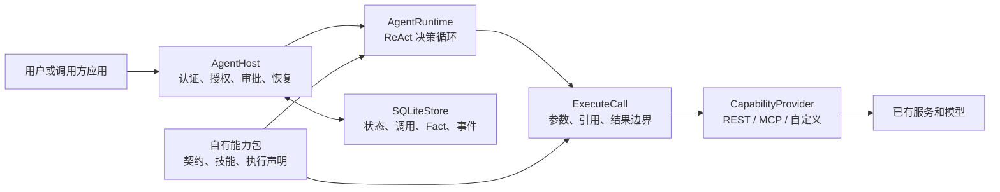

# Agenstra

语言 / Language：**简体中文** · [English](README.md)

**让现有系统更容易接入 Agent。**

Agenstra 是一个用 Go 实现、面向现有系统接入的 Agent 框架。它提供决策、工具调用、会话上下文、授权审批和任务恢复等通用能力，让已有的业务系统增加自然语言任务入口。原有的 API、SDK 和页面操作继续承担实际执行，通过 REST、OpenAPI、MCP 或自定义适配交给 Agent 使用。

**接入方主要补充能力声明、使用说明、连接与授权配置，以及按需编写的少量适配代码；Agent 的运行机制由框架提供。** 业务规则继续复用原系统的实现，聊天界面可以沿用原系统的设计。

从[最小 REST 接入教程](docs/tutorial.md)开始，或按[现有系统接入清单](docs/host-integration.md)把 Agent 接入已有的前后端应用。

## 接入方需要新增什么

| 接入内容 | 需要补充的部分 | 框架已经负责的部分 |
| --- | --- | --- |
| 已有业务接口 | 把选定接口登记为能力包，声明输入、输出、执行性质与审批要求；已有 OpenAPI 可导入草稿。 | 能力目录、ReAct 决策、工具调用、参数校验和结果证据。 |
| 领域知识 | 按需添加使用说明或技能文件，解释前提、单位和结果含义。 | 按任务读取技能、组织上下文和引用真实结果。 |
| 用户与部署 | 配置模型、持久存储、用户连接和能力授权；接入宿主已验证的登录身份。 | 用户级运行隔离、调用前授权检查、审批、长任务轮询和恢复。 |
| 聊天与页面操作（可选） | 对接宿主自己的聊天 UI；需要操作页面时，再声明前端动作、提供页面观察并用 handler 调用原函数或接口。 | 无 UI 的 JS SDK、会话历史与上下文、消息队列、动作投递和回执恢复。 |

对于内置连接器支持的 REST 或 MCP 接口，接入主要是声明与配置。需要操作原页面或调用特殊 SDK 时，再增加对应的 handler 或 `CapabilityProvider` 适配。只调用后端能力时，可以直接使用 HTTP API，无需接入前端控制桥。

例如，订单系统已经有“查询订单”的 API 和“打开详情”的页面函数。接入时，把查询 API 声明为能力，再把打开详情登记为前端动作，由 handler 调用原页面函数。用户说“查一下待处理订单，打开订单 1001”，框架负责选择能力、传递参数、按配置请求审批并等待执行结果；订单查询、权限校验和页面跳转仍走原系统的实现。

## 从现有系统开始接入

1. **选一个已有操作。** 先接通一个明确的查询或动作，复用原接口和业务规则，再逐步增加能力。
2. **描述如何使用。** REST 可手写 `agenstra.rest-pack.v2` 清单，或从 OpenAPI 3.0/3.1 JSON 中导入指定 `operationId`；MCP 可固定选定工具的契约哈希。审查输入输出、`effect`、凭据绑定、幂等、审批及长任务状态；按需补充技能文件并固定 SHA-256。
3. **绑定运行配置。** 指定包路径、模型连接、持久数据库、各用户的能力授权与凭据引用，并明确是否允许把外部数据发送给模型。
4. **接入调用入口。** 启动框架服务，通过 HTTP API 提交任务。需要聊天时接入 JS SDK 和宿主 UI；需要控制页面时，再注册前端动作与 handler。会话上下文和运行检查点由框架管理，宿主通过会话 ID 选择会话。
5. **验证实际场景。** 用真实模型和接口检查能力选择、权限、审批、错误路径与结果质量。后续增加业务能力时，沿用能力包和适配接口扩展。

完整示例见[REST 接入教程](docs/tutorial.md)和[Web 接入指南](docs/web-integration.md)。SDK 可用 `node web/export-client.mjs /path/to/host/vendor/agenstra` 导出 JS、TypeScript 声明和 SHA-256 记录，供宿主固定版本使用，无需新增 npm 运行时依赖。

## 先体验接入效果

需要 Go 1.26+，在仓库根目录执行：

```sh
go run ./examples/web-integration
```

打开 `http://127.0.0.1:8092`，发送“查询待处理订单并显示列表”或“打开订单 1001”。示例展示如何连接已有后端接口和页面动作，使用演示数据与固定 `DecisionModel`，无需模型密钥。示例聊天 UI 属于演示应用；实际接入时使用自己的界面、身份、业务接口和模型。详见[示例说明](examples/web-integration/README.md)。

## 架构与运行边界

Agenstra 可独立部署，通过 HTTP API 为现有系统提供 Agent 服务；Go 应用也可使用公开接口接入。接入方决定能力粒度、使用规则和授权策略，运行时根据任务与真实结果逐步选择下一步操作。

当前持久宿主支持**单节点、持久本地磁盘和 SQLite WAL**。一个部署可以配置多个用户，每个用户有独立的能力授权和连接。一个项目拥有一个能力包；任务可以显式组合其他项目中已授权的能力，详见[跨项目任务](docs/cross-project-tasks.md)。包括读取在内的所有能力都需要明确授权。分布式高可用、自动保留期清理、真实模型质量和外部计算正确性仍需另行设计或验收。

本仓库发布框架、通用测试、部署模板、教程和本地演示。生产使用时，需要提供自己的业务能力包、模型连接与凭据；`deploy/deployment.example.json` 用于配置接入。



| 组件 | 负责什么 |
| --- | --- |
| `AgentRuntime` | 看任务、能力目录、技能和真实观察；一次决定工具调用、读取技能、检查结果、追问或最终回答。没有固定场景 DAG 或预先计划模式。 |
| `AgentHost` | 按用户保存运行、调用前记录、审批、租约、超时、后台作业轮询、断线恢复及取消。 |
| `ExecuteCall` | 校验能力调用与授权；运行内核将已验证的结果保存为带来源的 Fact。 |
| `CapabilityProvider` | 统一能力、技能、调用和结果接口；内置 REST 与 MCP 连接器，也可实现自定义 Provider。 |
| 能力包 | 明确暴露哪些能力、输入输出契约、使用说明、执行性质、幂等策略和后台作业状态映射；由接入方审查和部署。 |
| `CapabilityRegistry` | 保存经过校验的不可变版本、当前启用版本、用户连接与管理审计；可选启用。 |

更完整的执行与安全边界见[架构说明](docs/architecture.md)。

## 安装与本地运行

需要 Go 1.26+。在仓库根目录执行：

```sh
git clone https://github.com/KHG420/agenstra.git
cd agenstra
go mod download
CGO_ENABLED=0 go build -trimpath -o dist/ ./cmd/...
```

构建后，`dist/` 中包含四个独立命令。SQLite 存储与 JSON Schema 校验使用纯 Go 库；管理页面及其静态资源嵌入服务端二进制。

| 命令 | 用途 |
| --- | --- |
| `agenstra` | 检查能力目录或执行本地任务。 |
| `agenstra-serve` | 提供 HTTP API、持久化 worker 和可选管理入口。 |
| `agenstra-manage` | 通过管理 API 校验、发布和管理能力版本与授权。 |
| `agenstra-import-openapi` | 将指定 OpenAPI 操作导入为 REST 能力包草稿。 |

REST 与 MCP 支持均包含在 Go 二进制中。按[接入教程](docs/tutorial.md)创建自己的包，并设置清单引用的环境变量后，`agenstra` 命令可先检查能力目录，不调用 LLM：

```sh
go run ./cmd/agenstra \
  --pack local/packs/records/pack.json --inspect
```

其中 `local/packs/records/pack.json` 由你按教程创建，不在仓库内。服务运行还需要：

- `AGENT_MODEL`：模型名称。
- `AGENT_MODEL_BASE_URL`：模型网关基地址，例如 `https://gateway.example/v1`；适配器请求其 `/chat/completions`。
- `AGENT_MODEL_API_KEY`：模型网关密钥。
- 部署配置中指定的每个用户 API key、外部接口地址与凭据环境变量。

默认模型适配器要求 `/chat/completions` 返回 JSON 字符串决策，使用 `response_format: {"type":"json_object"}`。模型必须实际支持这一协议；其他模型可实现 `DecisionModel` 接口接入。准备好自己的 `local/deployment.json` 后启动：

```sh
go run ./cmd/agenstra-serve \
  --config local/deployment.json
```

使用已编译服务时，执行 `./dist/agenstra-serve --config local/deployment.json`。容器构建与持久存储配置见[部署与运维](docs/deployment.md)。

默认监听 `127.0.0.1:8091`。`GET /readyz` 检查数据库和后台 worker 是否就绪。`POST /runs` 只创建任务；worker 自动执行并唤醒等待中的任务。

```sh
curl -sS http://127.0.0.1:8091/runs \
  -H "Authorization: Bearer $AGENT_OPERATOR_API_KEY" \
  -H 'Content-Type: application/json' \
  -d '{"pack_id":"records","instruction":"查询记录 R-1 并说明结果","request_id":"record-R-1-001"}'
```

同一用户提交相同 `request_id` 和内容会得到同一个运行；相同 ID 配不同内容会冲突。响应含 `run_id`、`status`、`revision` 等状态信息。使用 `GET /runs/{run_id}` 跟踪；完整结果由 `GET /runs/{run_id}/artifacts/{fact_id}` 读取。HTTP 状态和审批示例见[部署与运维](docs/deployment.md)。

## 按需使用已有能力

基础接入可以从能力包和运行 API 开始，再根据宿主需求启用相应模块。

| 能力 | 提供什么 | 接入文档 |
| --- | --- | --- |
| Web 集成 | 无 UI 的聊天/会话接口、框架管理的上下文、消息排队、JS SDK 和可选页面控制桥。 | [Web 接入指南](docs/web-integration.md) |
| 定时任务 | 一次性时间、固定间隔、带 IANA 时区的五字段 Cron；定义和历史持久保存，触发时重新检查权限。 | [定时任务与宿主接入](docs/scheduled-tasks.md) |
| 记忆 | 跨运行保存偏好、长期约束与能力包约定；明确默认值立即生效，三次独立输入中的稳定习惯可自动成为默认偏好。宿主可查看、修改、遗忘并追溯来源。 | [记忆设计与宿主管理](docs/memory-management.md) |
| 能力管理（可选） | CLI 与 Web 共享草稿，校验、发布、启用和回滚能力版本，管理用户连接与授权。 | [能力管理指南](docs/capability-management.md) |
| 跨项目任务 | 显式选择其他项目的能力，按目标身份、授权交集与受限任务范围执行。 | [跨项目任务](docs/cross-project-tasks.md) |

生产配置、容器部署、HTTP 状态和运维检查见[部署与运维](docs/deployment.md)。

## 在线管理能力（可选）

在部署配置中启用 `management` 并设置独立的 `AGENSTRA_ADMIN_API_KEY` 后，可访问 `/admin`，或使用同一管理 API 的 CLI。以下命令要求服务已启动，能力包清单已创建；CLI 默认连接 `http://127.0.0.1:8091`：

```sh
go run ./cmd/agenstra-manage validate local/packs/records/pack.json
go run ./cmd/agenstra-manage publish local/packs/records/pack.json
go run ./cmd/agenstra-manage list
```

发布不会自动启用或授权。从 `list` 结果读取完整内容哈希和当前修订版本，明确启用后，再为用户绑定连接与能力授权；启用旧版本即回滚。新版本只影响新任务，撤销授权则会立即影响已有任务。连接记录保存环境变量或 `secret:NAME` 引用，不保存明文密钥。配置示例、启用与回滚命令、连接检查及备份要求见[能力管理指南](docs/capability-management.md)。

## 能力包支持范围

| 来源 | 已提供的接入方式 | 导入后仍需审查 |
| --- | --- | --- |
| REST JSON | GET/POST/PUT/PATCH/DELETE；路径、查询、请求头、请求体绑定；嵌套 JSON Schema、状态码和服务错误码。 | 端点、认证、`effect`、重试/幂等、结果含义。 |
| OpenAPI 3.0/3.1 JSON | 选择 `operationId`，转成 REST v2 草稿；支持本地 schema 引用及显式 bearer 环境变量。 | 生成的契约、未支持的序列化/认证、技能、审批、后台作业映射。 |
| MCP | stdio 与 streamable HTTP；分页发现、选定工具、输入输出校验、已审查契约哈希。 | 运行命令/端点、工具作用、引用有效期、幂等与授权。 |
| 自定义 SDK | 实现 `CapabilityProvider` 协议，由应用提供用户级连接工厂。 | SDK 的身份隔离、输入输出验证和执行保证。 |

OpenAPI 导入命令示意（把路径和 operationId 换成自己的）：

```sh
go run ./cmd/agenstra-import-openapi \
  --spec local/openapi.json \
  --out local/packs/records/pack.json \
  --name records \
  --base-url-env RECORDS_API_URL \
  --token-env RECORDS_API_TOKEN \
  --operation records.get
```

导入命令**不会**据接口名字推断审批、幂等性或后台任务。写操作和长期任务的声明请按[接入教程](docs/tutorial.md)补充和验证。

## 运行与数据保证

- Host 在外部调用前保存调用 ID、确切参数和哈希。对于失败后结果不确定的调用，只有声明为安全或真正可幂等重放的能力才能按同一 ID 恢复；其他情况进入 `needs_reconciliation`，由接入方核对真实外部状态。
- 被批准的是特定用户、特定调用和参数哈希；提交前会重新检查身份、权限及租约。技能文本不能跳过这些检查。
- 完整工具结果作为 Fact 单独持久化；上下文预算保留任务约束和 Fact 身份，优先呈现近期证据，并明确标记遗漏内容供按路径检查。工具传参仍可通过 Fact 引用获取完整原值，详见[上下文管理设计](docs/context-management.md)。Fact ID 是框架本地证据 ID，不等于外部资源 ID。
- 对声明了 `OperationBinding` 的后台作业，Host 保存外部作业回执并轮询状态接口；HTTP 请求成功或返回 `queued` 不代表任务完成。
- 运行、事件、Fact 和续接接口按 `owner_id` 隔离；一个部署可配置多个用户及不同能力集合。

取消只停止本地编排，不承诺撤销已提交到外部系统的作业。SQLite WAL 适合当前单节点范围；请使用持久磁盘并制定备份与数据保留策略。

## 从 Python 版本切换

Go 版本保留部署 JSON 格式、能力包清单、HTTP 路由与响应格式，以及 SQLite v1 运行数据库结构。兼容性测试覆盖读取并继续执行 Python 版本创建的运行，包括已保存的 Fact、请求 ID 和 REST 契约指纹。

先备份数据库并停止 Python worker，再使用相同部署配置与持久数据库路径启动 Go 服务；启动命令改为上面的 Go 命令。自定义 Python `CapabilityProvider` 和 `DecisionModel` 实现需要移植到对应的 Go 接口。

## 开发验证

```sh
go test -race ./...
go vet ./...
go build ./cmd/...
```

测试使用临时生成的 REST/MCP 契约、模型替身和 SQLite；不需要场景能力包或真实外部服务。发布前仍应在目标环境验收真实身份、模型决策、接口契约、长任务以及运维条件。当前实现的取舍和上线前检查见[架构说明](docs/architecture.md)与[部署与运维](docs/deployment.md)。
