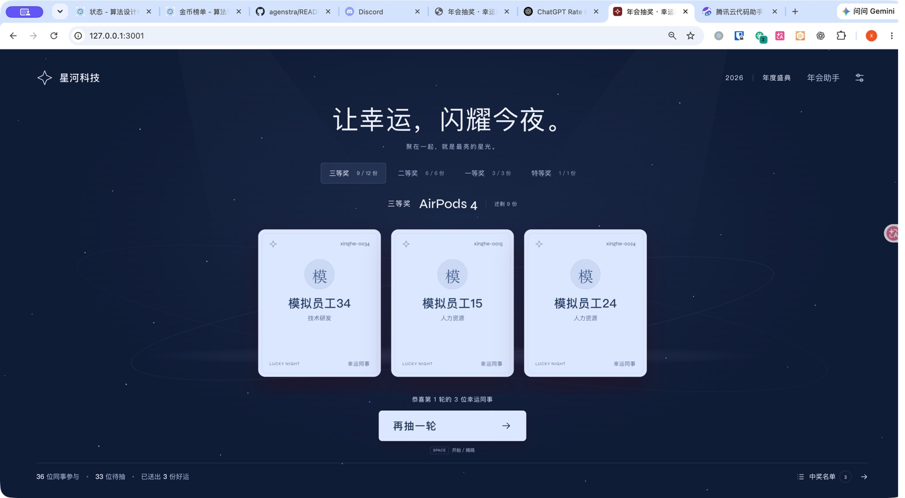

# 年会抽奖接入验证记录

验证时间：2026-10-01 至 2026-10-02。整理时间：2026-10-05。

本记录保存年会抽奖宿主接入聊天、浏览器桥与跨项目公司名单的历史证据。验证时 Agenstra 基线为 `e647a90a6ad67e9224717541dbe114eb6128585d`，抽奖仓库基线为 `5210c90eb6a6178c6a082b877db0ea30fd0475c9`。原宿主另有 16 个已有修改或新增文件，复制清单与当时 SHA-256 见[基线清单](annual-lottery-baseline.json)。这些已有功能不能计为 Agent 接入新增功能。

整理时只归档记录、基线、运行证据和截图，没有重新调用真实模型或运行宿主应用。旧启动示例依赖独立抽奖工作树及其未提交配套代码，该工作树现已不存在，因此没有将示例作为当前可运行的接入入口加入主线。现行接入步骤以[宿主接入指南](host-integration.md)、[快速接入指南](quick-integration.md)和[跨项目授权说明](cross-project-tasks.md)为准。

## 接入方式与业务边界

宿主通过 frontend profile 声明 17 项页面动作，handler 调用原系统的业务命令和 `/api/activity`，保持原校验、随机抽奖、版本复核及幂等逻辑。11 种业务写操作没有在 Agenstra 核心中另建场景分支。舞台使用按需加载的助手，后台提供受控 tab、分页、编辑器与文件预览入口。

| 原系统功能 | Agent 操作 | 当时的执行与核验方式 |
|---|---|---|
| 活动信息、人数、奖项、名单与中奖历史 | `ui.activity.read` | summary/people/history/round；人员每页 30，历史每页 5 轮，大轮次中奖人员单独分页 |
| 舞台主题、奖项选择、后台、中奖面板与后台 tabs | `ui.view` | 原状态回调；保留抽奖中的奖项切换锁 |
| 搜索、分页、中奖结果翻页、编辑器与取消预览 | `ui.view` | 原后台与舞台状态；未知实体 ID 拒绝 |
| Excel/CSV 文件选择、解析与预览 | `ui.people.preview` | 用户选择文件，复用原解析器和逐行校验 |
| 将当前预览追加或替换导入 | `ui.people.import_preview` | 精确审批绑定 mode、previewId 和业务版本，执行前复核 |
| 公司、品牌副标题、年会名称与年份 | `ui.settings.save` | 原 settings 命令，保留字段校验和活动锁 |
| 新增、编辑与删除人员 | `ui.people.save`、`ui.people.delete` | 原命令，保留工号规则、获奖人员保护和名额检查 |
| 批量追加或替换人员、跨项目名单导入 | `ui.people.import` | 整名单 Fact 引用，经审批后执行单个原 import 命令 |
| 新增、编辑与删除奖项 | `ui.prizes.save`、`ui.prizes.delete` | 原命令，保留总容量、每轮人数及已有中奖奖项保护 |
| 开始、揭晓与取消抽奖 | `ui.draw.start`、`ui.draw.reveal`、`ui.draw.cancel` | 原命令和稳定 roundId，随机结果由原后端保存 |
| 重置与回退中奖轮次 | `ui.history.reset`、`ui.history.rollback` | 精确审批和业务版本复核，使用原重置与回退规则 |
| 模板、人员名单和中奖名单导出 | `ui.export` | 原下载代码；业务回执只证明发起下载，文件落盘另行核实 |
| 全屏进入与退出 | `ui.fullscreen` | 进入仍受浏览器 user activation 限制，由用户点击确认 |

业务版本 `activityRevision` 与浏览器桥版本分开使用。写操作传入观察到的 `expectedRevision`；审批等待期间若原系统被人工修改，原业务层拒绝旧版本写入。文件导入同时校验真实 preview ID，避免批准后替换文件。

## 身份与跨项目数据链

历史联调在回环地址运行 Agent（8093）与抽奖宿主（3001）。助手使用宿主后端的同源 `/agent/` 代理，`/api/agent-session` 从已有登录状态取得用户并交换短票据。测试用户为本机入口的 `local_seedy`，长期凭据只存在服务器环境。

公司名单是独立只读能力包 `company-directory`，使用自己的 Bearer 凭据、`company-demo-admin` 主体、`companies.list` 与 `employees.list` 能力。三家公司及各 36 位员工全部为虚构数据。发起项目配置只读委派，每条任务还需明确选择来源；错误凭据不能通过来源身份验证。

实际执行链为：

```text
company-directory::companies.list
→ 以观察到的公司 ID 查询 employees.list
→ 通过 $fact_value 引用完整 data.people
→ ui.get_context 取得业务版本
→ ui.people.import 的精确审批
→ 原 /api/activity 保存
→ ui.command_status 及保存结果核验
```

当时浏览器上下文 Fact 有 30 秒有效期，审批参数中的业务版本使用已观察到的数值，员工数组保留持久 Fact 引用。这是历史实现条件；当前引用作用域以现行能力契约为准。网络中断与加载失败保留未知结果，不能当作确定失败或据此重复写入。

真实模型使用框架已有的 `HTTPJSONDecisionModel`。历史配置名为 `deepseek-v4-flash`，服务连通响应模型名为 `deepseek-flash`，HTTP 连通状态为 200。配置与凭据没有写入本记录或运行证据。

## 历史验证结果

以下命令和结果来自当时的工作树验证，不能作为当前 `main` 的重新验收结果：

| 范围 | 命令 | 历史结果 |
|---|---|---|
| 抽奖宿主 | `npm test` | 33 项通过，包含 6 项 Agent 测试及原业务、卡片、本机入口测试 |
| 抽奖宿主 | `npx tsc --noEmit`、`npm run lint`、`npm run build` | 通过；构建包含两条 Agent 服务端路由 |
| Agenstra | `go test -race ./...`、`go vet ./...`、`go build ./cmd/...` | 初始验证及快进到上述基线后再次通过 |
| SDK | `cd web && npm test` | 28 项通过 |
| 旧本机示例 | Go 竞态测试、vet 和启动器语法检查 | 当时通过；覆盖来源认证、完整名单引用、当前消息识别和失败后不重复提交 |

[运行证据](annual-lottery-verification.json)保存 9 个运行：6 个 completed、1 个 failed、2 个 cancelled。取消的运行记录旧构建加载失败和未知结果阻塞；不能计入成功任务。

| 自然语言任务 | 运行 ID | 已记录的实际结果 |
|---|---|---|
| 查看参与人数和奖项，并切换星光主题 | `c9e25109-21f9-57a1-b102-584b8c68a848` | completed；156 人、4 个奖项，页面主题为 `data-theme=2` |
| 从公司项目取星河科技全部员工并替换导入 | `8b0bd8ab-339a-5519-8115-fd068b5b8fc9` | completed；审批前 revision 0/156 人，批准后 revision 1/36 人，奖项保持 |
| 三等奖开始并揭晓一轮 | `bb074c1c-ce25-5af1-a1ec-153a35d3bf92` | completed；revision 1→2→3，保存 1 轮历史及 3 位唯一中奖员工 |
| 导出中奖名单并开始待取消轮次 | `5f9a2bef-6557-5aad-86ed-e87d650e05a5` | failed；导出和开始回执成功，CSV 保存 3 条数据；后续 `model_decision_invalid`，没有记为整体完成 |
| 取消当前抽奖并核对无新增记录 | `4c423e43-8e00-5345-b6ca-0d5c2b335a13` | completed；revision 4→5，活动轮次清空，仍为 1 轮历史和 3 位中奖人员 |
| 回退最近中奖轮次并恢复名额 | `5d395064-8ec0-5e30-af77-2e28cd1435cc` | completed；批准原 roundIds 和 expectedRevision=5；revision 5→6，历史清空，36 人全部待抽 |
| 打开人员管理、搜索技术研发 | `b9313643-e8f5-56ae-9a86-465134be78ff` | completed；后台人员 tab、搜索值和 12 条待抽人员均由实际页面核验 |

当时另行核对的 CSV 为 8 列、3 条数据，与保存的三名中奖员工一致。截图记录导入和揭晓后的中间状态：36 位参与者、33 位待抽、3 位中奖人员。



## 限制与当时的资源收尾

- 公司项目只提供模拟 API，没有独立公司 UI；联调未部署到生产环境。
- 模型验证覆盖上述具体请求，不保证任意措辞都能一次完成。审批、业务拒绝、版本变化和未知结果必须依据真实回执处理。
- 文件选择、全屏许可和操作系统保存文件仍由真实用户与浏览器控制。
- 原记录确认启动器及其子服务退出、3001/8093 端口释放、本任务浏览器标签关闭，未启动 Docker 测试容器。
- 原记录最终活动为 revision 6、36 名员工、0 轮中奖历史、无活动轮次，人员与奖品名额已恢复。

证据中的 `final_integrity` 和 `resource_cleanup` 保存的是 2026-10-02 验证结束时的状态，包括当时尚未提交、合并和推送的事实；它们不描述本记录在 2026-10-05 的归档提交状态。
