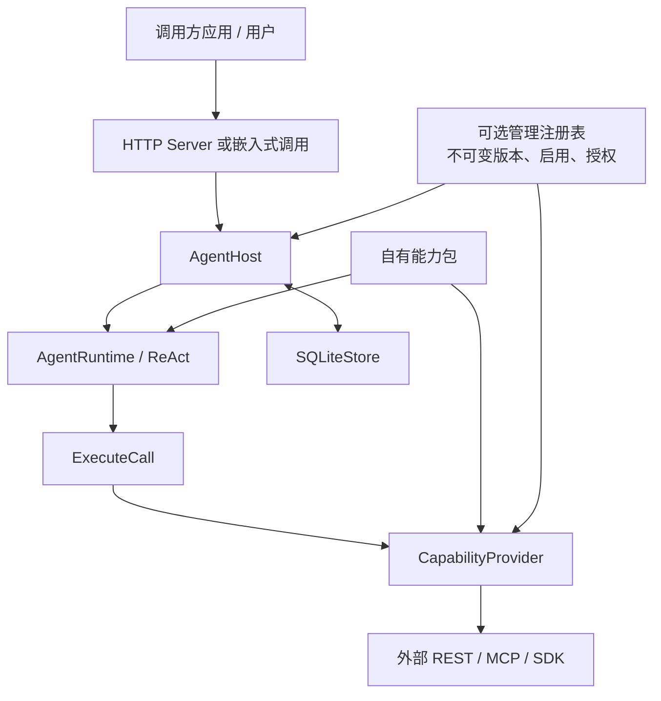
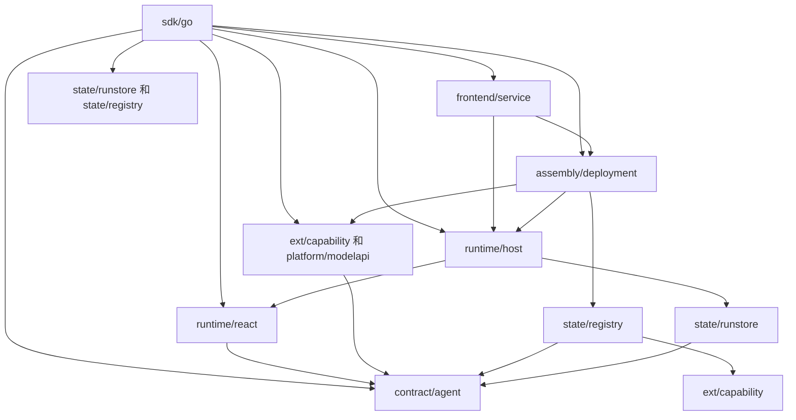
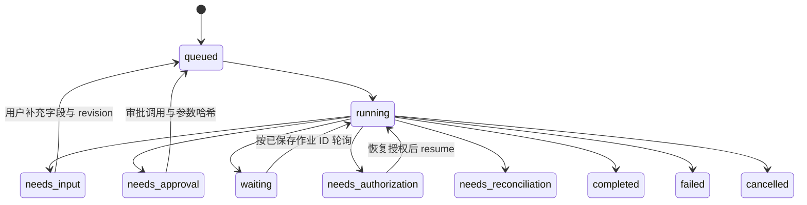

# 架构与扩展边界

本框架让不同应用重复使用**同一个 Agent 运行内核**，把各自已有的能力以经过审查的包导入。部署方决定暴露哪些 API、模型或工具，以及谁能使用、什么数据能发给模型。框架不持有具体场景的算法，也不把某个应用的流程写成代码分支。

## 1. 分层



| 所有者 | 固定职责 | 扩展方式 |
| --- | --- | --- |
| `AgentRuntime` | 根据任务、能力目录、技能、观察和 Fact 决定下一步；验证决策类型、预算和事实引用。 | 更换实现 `DecisionModel` 的模型适配器，不修改场景流程代码。 |
| `AgentHost` | 认证后的运行生命周期、授权、审批、租约、检查点、等待/恢复、调用超时，以及记忆学习与宿主管理。 | 配置用户、策略和连接工厂；通过记忆 API 管理默认值。 |
| `ExecuteCall` | 校验能力调用与授权，运行内核记录 Fact 来源。 | 通常无需修改。 |
| `CapabilityProvider` | 提供能力目录和技能，验证输入、调用外部服务、验证输出并返回结构化结果或安全错误码。 | REST、MCP 内置；特殊 SDK 实现同一协议。 |
| 能力包 | 选取能力、固定契约、描述使用规则和执行性质。 | 由接入方维护并通过部署配置引用；本仓库不提供实际包。 |
| 管理注册表（可选） | 校验并保存不可变包版本，原子切换新任务的启用版本，记录连接、授权和审计。 | CLI 与 Web 调用同一管理 API；静态配置部署仍可继续使用。 |
| 外部系统 | 数据、计算、访问控制、幂等处理和正式产物。 | 保持现有服务，必要时暴露稳定的 API。 |

`internal/contract/agent/providers.go` 定义 `CapabilityProvider`、`CapabilityDescription`、`CapabilityResult`、`InvocationContext` 和 `OperationBinding`。`internal/ext/capability/loader.go` 根据受信任的清单 schema 打开 REST/MCP/旧版 REST 包。用户的自然语言请求不允许携带新清单、端点、命令或凭据。

启用管理注册表时，Host 在创建运行时保存当前发布版本的内容哈希，恢复运行时始终加载该版本；管理员启用新版只影响新任务。授权和连接身份仍在每次执行前重新检查，撤销权限会使已有任务暂停。注册表当前使用单节点 SQLite WAL 和受控的本地发布目录，必须一起备份。参见[能力管理指南](capability-management.md)。

### 源码模块与依赖方向

仓库使用一个 Go module，目录组织参考 reasonix 的 studio 分支：实现按职责分组放在 `internal/`，公开接入放在 `sdk/`，命令、示例、部署和文档各自独立。宿主通过 `github.com/KHG420/agenstra/sdk/go` 接入。共享契约、执行状态的所有者和具体适配器分别位于真实的 Go package；SDK 的类型别名和转发函数指向各自的实现包。

```text
agenstra/
├── cmd/                          # 五个命令的接线
├── internal/
│   ├── assembly/deployment/      # 配置、可信身份、连接和模型选择装配
│   ├── base/
│   │   ├── cron/                 # 日历、时区与 Cron
│   │   └── jsonvalue/            # JSON 编码、复制与严格解码
│   ├── contract/
│   │   ├── agent/                # 值契约、校验和模型协议
│   │   └── schema/               # JSON Schema 校验
│   ├── ext/
│   │   ├── capability/           # REST/MCP Provider、技能和可信包加载
│   │   ├── openapi/              # OpenAPI 转换
│   │   └── packfiles/            # 包文件与发布摘要核验
│   ├── frontend/
│   │   ├── admin/                # 管理控制台静态资源和 JS 测试
│   │   └── service/              # HTTP、worker、聊天和浏览器集成
│   ├── platform/
│   │   ├── mcptransport/         # MCP 连接、交换和清理
│   │   └── modelapi/             # HTTP 模型协议、测量、重试和记忆提取
│   ├── runtime/
│   │   ├── react/                # 临时决策、上下文、Fact 引用和执行证据
│   │   └── host/                 # 授权、审批、租约、检查点和恢复
│   └── state/
│       ├── runstore/             # 运行、回执、产物、记忆和定时任务 SQLite
│       └── registry/             # 不可变发布、绑定、草稿和模型配置修订
├── sdk/
│   ├── go/                       # 公开 Go 类型与构造/接入函数
│   └── web/                      # 无 UI 客户端、可选聊天组件和会话助手
├── examples/                     # 最少宿主接入演示
├── deploy/                       # Docker 和配置模板
└── docs/                         # 架构、接入和运维文档
```



图中展示主要依赖，底层 JSON、Schema、Cron、文件核验、MCP 传输及静态资源依赖见下表。依赖方向以生产 import 为准；上层集成测试可以组合多个下层模块。

| 位置 | 职责与依赖边界 |
| --- | --- |
| `sdk/go/` | 公开接入类型、错误值和构造函数；直接使用对应所有者的定义，不持有另一份运行状态。 |
| `internal/contract/agent/` | JSON/Fact/决策、能力清单、策略、配置、记忆、定时任务、Web 值契约及纯校验；只依赖 JSON、Schema 和日历模块，不创建 Host、数据库、连接或凭据。 |
| `internal/runtime/react/` | ReAct 决策、上下文预算、引用、完成校验、`ExecuteCall` 与调用回执；依赖共享契约和 JSON，不导入 Host、Store、部署或 HTTP。 |
| `internal/runtime/host/` | 当前授权、审批、租约、持久检查点、等待与恢复、记忆学习和定时派发；依赖 ReAct、runstore、契约及基础模块，不导入部署、模型适配器、注册表或前端。 |
| `internal/state/runstore/` | 既有 SQLite 表、事务、fencing、产物、调用日志、记忆和定时任务；只依赖契约与 JSON。owner 查询和租约核验由存储执行，业务授权由 Host 执行。 |
| `internal/state/registry/` | 发布、启用、绑定、草稿、模型配置修订与原子审计；依赖契约、能力清单校验、JSON 和包文件核验；私有数据库只通过所属操作访问。 |
| `internal/platform/modelapi/` | 模型 HTTP 消息、JSON/tool 输出、输入测量、重试、取消、用量和记忆提取；只依赖契约与 JSON，不选择部署模型或解析宿主凭据。 |
| `internal/ext/capability/` | 可信清单加载、REST/MCP 适配、技能、请求/响应契约和连接清理；依赖契约、JSON、OpenAPI 与 MCP 传输，不读取 Host、SQLite 或 live grants。 |
| `internal/assembly/deployment/` | 部署配置、可信身份验证、连接引用、模型目录选择和业务校验回调；组合 Host、适配器和注册表，执行仍由 Host 负责。 |
| `internal/frontend/service/` | HTTP 路由、管理接线、可选 worker、聊天和浏览器桥接；调用同一 Host 和部署装配；WebStore 仅拥有可选 Web 表。Close 先等待 worker 退出，再关闭集成资源。 |
| `internal/base/jsonvalue/`、`internal/base/cron/` | 有限 JSON、复制、严格解码、日历与 DST；无运行和数据库状态。 |
| `internal/contract/schema/` | 本地 Schema 编译和有限 JSON 校验，不判断授权、审批或业务终态。 |
| `internal/ext/openapi/`、`internal/ext/packfiles/` | OpenAPI 草稿转换、技能路径和发布目录完整性核验；不读注册表数据库或决定发布事务。 |
| `internal/platform/mcptransport/` | stdio/HTTP/SSE 交换、取消、管道与进程清理；能力语义和凭据绑定由调用层负责。 |
| `internal/frontend/admin/`、`sdk/web/` | 各自拥有静态资源和 JS 测试；service 使用其嵌入资源。Web 客户端、聊天组件、会话助手保留原 ES module 边界。 |
| `cmd/`、`examples/` | 通过 Go SDK 接线及演示接入，不复制运行流程。 |

Host 在使用方定义最小的运行模型选择接口：读取独立 `Snapshot`，并以已冻结的 `ModelConfiguration` 调用 `SelectModel`。部署层的 `ModelManager` 实现它，Host 无需识别具体管理器。新任务只保存实际使用的决策和记忆 profile，恢复时继续采用已保存选择；实时目录修改仍只影响新任务。

模型配置的持久修订检查、保存和审计由注册表在同一事务中执行；ModelManager 保留独立解码的配置，调用方修改输入或返回值不能改变现有任务。HTTP 初始化通过 `Initialized` 查询连接归属，失败时只关闭本次打开的注册表连接。

可选 `InvocationValidator` 使用可跨包识别的导出方法 `ValidateInvocation`。REST、MCP、跨项目路由和浏览器包装继续转发原有前置校验，审批后执行仍重新核验 live 状态。调用回执、参数哈希、幂等身份和 checkpoint 写入继续由 Runtime/Host 与 runstore 的原路径共同完成。

测试按职责保存，跨 HTTP、浏览器、模型、授权和持久恢复的用例位于实际组合层。原有六份测试数据内容保持一致，并随使用它们的包保存；Go SDK 另有公开接入测试。`make check` 的 `./...` 覆盖全部 Go 包，Web 命令覆盖 SDK 和管理资源测试。完整迁移记录见[重构交接文档](refactor-handoff.md)。

## 2. ReAct 决策循环

模型一次只能返回一种有类型的 `agenstra.decision.v1` 决策：

| 决策 | 含义 |
| --- | --- |
| `tool_batch` | 发起一批互相独立的能力调用。依赖前一步结果的调用要等到下轮观察。 |
| `read_skill` | 按需读取能力包中已固定哈希的使用说明。 |
| `inspect_capability` | 查看一个能力的完整输入/输出契约。 |
| `inspect_fact` | 从持久 Fact 的指定路径读取有界视图，避免仅凭截断预览猜测。 |
| `request_input` | 缺必要信息时暂停并向用户追问。 |
| `final` | 给出回答并引用本次运行真实存在的 Fact。 |

运行内核没有 `PlanDecision`，也没有对某些工具名的特殊编排规则。多接口任务通过下一轮观察继续：先调用接口 A，获得 Fact 后从其 `data` 路径引用真实字段，再调用接口 B。`{"$fact_value":{"fact_id":"...","path":["data","id"]}}` 引用外部返回字段；`$fact_id` 只是本地证据 ID，不能当外部资源 ID 使用。框架解析引用时使用完整持久数据，即使模型上下文里只有预览。

接入方可把一次大型计算作为一个能力，也可把多个原子能力交给 Agent 组合。是否可组合取决于接口契约、数据质量、模型效果和场景规则，需要以代表性任务验收。

## 3. 持久执行语义

最终回答除引用身份检查外，可由宿主设置 `CompletionValidator` 校验业务结果状态、必需证据或回答内容。失败反馈回到同一决策循环，并消耗原有预算；详情及真实模型评测入口见[完成校验与模型评测](completion-evaluation.md)。

HTTP 入口通过 `AgentHost` 使用同一 ReAct 状态机。Host 把运行、轮次、观察、待调用、调用参数哈希、Fact、事件和审批状态写入 SQLite WAL；外部请求不在数据库写事务中执行。每次 claim 使用带有效期的租约和 fencing token，旧 worker 不能在租约丢失后写回本地状态。



在发出外部调用**之前**，Host 保存 invocation ID、参数与规范化哈希。如果调用结果不确定，例如响应丢失，重放行为由能力的 `replay` 保证决定：

- `safe`：读取类调用，可按相同输入重做。
- `idempotent`：外部接口必须真实地以相同幂等键识别同一操作。Host 提供同一个键；声明本身不能制造远端幂等性。
- `never`：不能安全自动重放；进入 `needs_reconciliation` 让接入方核对上游状态。

租约保护的是本地状态写入，不能撤回已经到达远端的 HTTP 请求。对于不能承受重复提交的接口，远端应提供幂等键或稳定作业查询能力。取消也只停止本地编排，不代表远端作业已取消。

`OperationBinding` 将外部作业回执映射到 `id_path`、`status_path`、`poll_capability`、`poll_argument`、pending/success/failure 状态、间隔和超时。Host 在 `waiting` 中定时调用状态接口，等待不会持续消耗模型轮次。作业 ID 应在连接重建后仍可用；短期连接内引用不能假装是长期资源 ID。

## 4. 权限、身份与数据边界

开发者管理和宿主用户运行分别授权。框架 HTTP 服务直接提供开发者控制台与管理 API，独立管理密钥控制模型配置、能力发布、连接绑定和授权策略；宿主业务角色不能换取这项权限。宿主仅接入按可信 owner 隔离的会话、任务、上下文、用量、记忆和自动化功能，不嵌入开发者控制台或代理管理 API。业务管理员的原系统权限仍由宿主核验。

部署配置以用户 API key 识别 `owner_id`，为该用户选定包、授权能力、审批能力和独立连接变量。可配置身份查询，在每次执行和恢复时重新检查对应主体。REST/MCP 凭据通过部署环境注入，不写进包，也不出现在模型能力目录中。

`effect` 说明调用是 `read`、`compute`、`write` 还是 `destructive`；执行仍以当前策略为准。审批绑定用户、确切调用、参数 SHA-256、修订版本和有效期。技能只提供使用说明，不增加授权。`allow_model_data` 决定该用户连接的数据是否可送给模型；若拒绝，Host 阻止相应运行，而不是悄悄泄露结果。

完整 Fact 持久保存，模型只收到有界预览。HTTP 的运行、事件、产物和续接请求按 owner 隔离。部署方仍需要 TLS、密钥管理、备份、日志策略，以及对模型服务的数据处理约定；框架并不取代外部服务原有的访问控制。

每轮上下文按实际 JSON 消息正文大小分配预算，保留任务、用户补充、全部 Fact 身份与当前检查内容，优先给近期证据提供预览。压力下可省略观察参数、按需加载目录 schema、移出旧技能或缩短旧观察窗口；完整状态和引用解析仍使用原始数据。调研依据、保留顺序、恢复规则和字符预算边界见[上下文管理设计](context-management.md)。

跨运行记忆独立于业务 Fact 与能力授权，按认证 owner 和 pack 保存。Host 校验当前用户消息中的候选，明确规则立即生效，三次独立习惯自动形成默认偏好；宿主通过 Go、HTTP 与 Web SDK 管理条目和来源。首次执行冻结 active 记忆投影，每次模型调用前过滤已更正/遗忘版本；偏好参与上下文预算。接口、研究依据和遗忘边界见[记忆设计与宿主管理](memory-management.md)。

## 5. 接入契约与上线范围

REST v2 清单支持嵌套 JSON Schema、路径/查询/请求头/请求体绑定、响应状态码契约、服务错误码、token 环境变量和可选技能。OpenAPI 导入仅生成选定 operationId 的草稿，不猜测审批、幂等和任务结果状态。MCP 清单选定工具并固定完整工具契约的 SHA-256，远端契约漂移会阻断导入。特殊协议可以实现 `CapabilityProvider`，保持 ReAct 和 Host 不变。

当前可验证的软件边界是单节点部署、SQLite WAL 持久盘、已有 HTTP/MCP 能力和兼容 JSON 决策的模型。上线前仍需用目标环境验证真实凭据、权限撤销、代表性多接口任务、幂等与作业查询、容量及备份恢复。多节点调度、自动数据保留清理、外部算法的正确性和模型回答质量不由框架单元测试保证。

接入过程见[从零接入教程](tutorial.md)，具体部署与状态处理见[部署与运维](deployment.md)。

跨项目任务可通过可选 `sources` 明确选择目标能力，并按发起项目委派、目标验证权限和任务范围取交集。目标身份、实际凭据、版本固定、项目记忆和各入口的完整接入说明见[跨项目任务、身份与授权](cross-project-tasks.md)。所有读取与轮询也必须明确授权。

## 独立工具并发

Host 与临时 Runtime 对同一 tool_batch 内符合条件的调用并发执行，默认最多 4 个（Host `max_concurrent_tools`，CLI `--max-concurrent-tools`；1 表示串行，Host 0 使用默认值）。Provider 通过可选的 `ConcurrentCapabilityProvider.ConcurrentInvocation(name)` 显式声明 Invoke 及请求校验可并发；REST v2 支持，跨项目路由转发源 Provider 的声明，部署连接包装和浏览器包装保留业务 Provider 的并发声明；浏览器能力共享页面状态，保持串行。当前 MCP 传输保持串行。

整个未完成批次必须是尚无执行尝试的独立 read/compute，具备 safe/idempotent 重放契约，无审批要求且未绑定异步 Operation。混合写操作、审批、运行中的作业、不支持并发的 Provider 和恢复中的调用沿用串行路径。Fact 参数在准备阶段从已有完整证据解析，不能依赖同批结果。

Host 先按调用顺序完成权限、引用、参数摘要与幂等绑定检查，并保存每个 in_flight 日志；IO 工作协程只写独立结果槽，全部退出后按原调用顺序保存观察与产物。取消会等待工作协程退出后关闭 Provider。响应或检查点丢失时，恢复沿用既有调用 ID、重放策略和租约校验；部分响应不明确时保留其他结果以及下一次唤醒时间。并发额度是每个运行的额度，总吞吐还受 max_concurrent_runs 限制。
