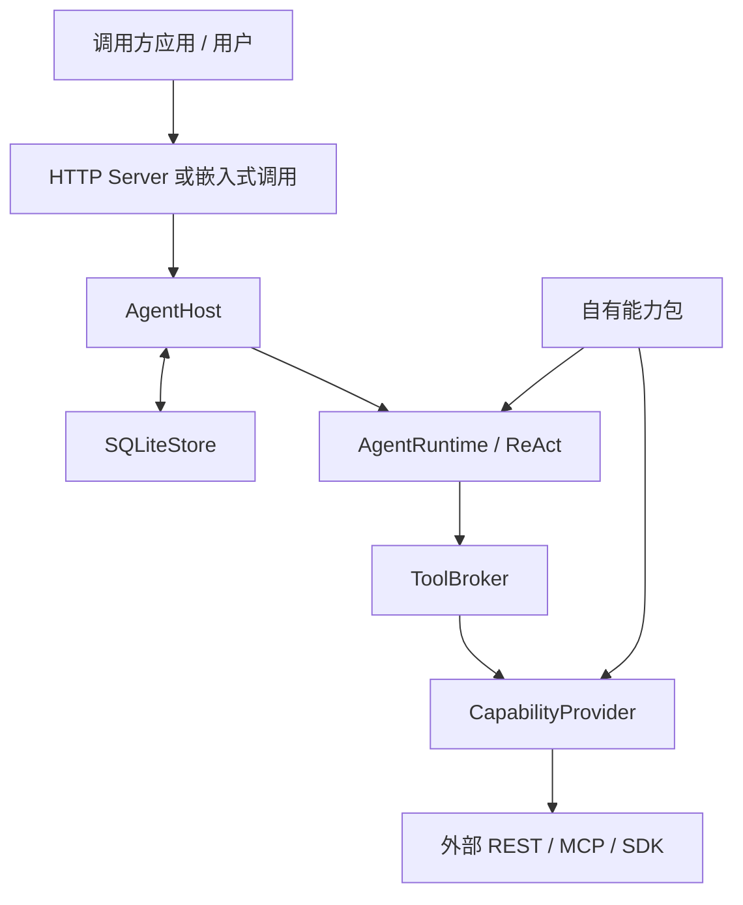
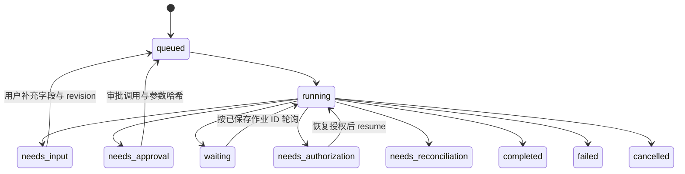

# 架构与扩展边界

本框架让不同应用重复使用**同一个 Agent 运行内核**，把各自已有的能力以经过审查的包导入。部署方决定暴露哪些 API、模型或工具，以及谁能使用、什么数据能发给模型。框架不持有具体场景的算法，也不把某个应用的流程写成代码分支。

## 1. 分层

| 所有者 | 固定职责 | 扩展方式 |
| --- | --- | --- |
| `AgentRuntime` | 根据任务、能力目录、技能、观察和 Fact 决定下一步；验证决策类型、预算和事实引用。 | 更换实现 `DecisionModel` 的模型适配器，不修改场景流程代码。 |
| `AgentHost` | 认证后的运行生命周期、授权、审批、租约、检查点、等待/恢复、调用超时。 | 配置用户、策略和连接工厂。 |
| `ToolBroker` | 执行前校验与 Fact 来源边界。 | 通常无需修改。 |
| `CapabilityProvider` | 提供能力目录和技能，验证输入、调用外部服务、验证输出并返回结构化结果或安全错误码。 | REST、MCP 内置；特殊 SDK 实现同一协议。 |
| 能力包 | 选取能力、固定契约、描述使用规则和执行性质。 | 由接入方维护并通过部署配置引用；本仓库不提供实际包。 |
| 外部系统 | 数据、计算、访问控制、幂等处理和正式产物。 | 保持现有服务，必要时暴露稳定的 API。 |

`src/agent_capability/providers.py` 定义 `CapabilityProvider`、`CapabilityDescription`、`CapabilityResult`、`InvocationContext` 和 `OperationBinding`。`src/agent_capability/loader.py` 根据受信任的清单 schema 打开 REST/MCP/旧版 REST 包。用户的自然语言请求不允许携带新清单、端点、命令或凭据。

## 2. ReAct 决策循环

模型一次只能返回一种有类型的 `agent-capability.decision.v1` 决策：

| 决策 | 含义 |
| --- | --- |
| `tool_batch` | 发起一批互相独立的能力调用。依赖前一步结果的调用要等到下轮观察。 |
| `read_skill` | 按需读取能力包中已固定哈希的使用说明。 |
| `inspect_capability` | 查看一个能力的完整输入/输出契约。 |
| `inspect_fact` | 从持久 Fact 的指定路径读取有界视图，避免仅凭截断预览猜测。 |
| `request_input` | 缺必要信息时暂停并向用户追问。 |
| `final` | 给出回答并引用本次运行真实存在的 Fact。 |

运行内核没有 `PlanDecision`，也没有对某些工具名的特殊编排规则。多接口任务通过下一轮观察继续：先调用接口 A，获得 Fact 后从其 `data` 路径引用真实字段，再调用接口 B。`{"$fact_value":{"fact_id":"...","path":["data","id"]}}` 引用外部返回字段；`$fact_id` 只是本地证据 ID，不能当外部资源 ID 使用。框架解析引用时使用完整持久数据，即使模型上下文里只有预览。

接入方可把一次大型计算作为一个能力，也可把多个原子能力交给 Agent 组合。是否可组合取决于接口契约、数据质量、模型效果和场景规则，需要以代表性任务验收。

## 3. 持久执行语义

HTTP 入口通过 `AgentHost` 使用同一 ReAct 状态机。Host 把运行、轮次、观察、待调用、调用参数哈希、Fact、事件和审批状态写入 SQLite WAL；外部请求不在数据库写事务中执行。每次 claim 使用带有效期的租约和 fencing token，旧 worker 不能在租约丢失后写回本地状态。

在发出外部调用**之前**，Host 保存 invocation ID、参数与规范化哈希。如果调用结果不确定，例如响应丢失，重放行为由能力的 `replay` 保证决定：

- `safe`：读取类调用，可按相同输入重做。
- `idempotent`：外部接口必须真实地以相同幂等键识别同一操作。Host 提供同一个键；声明本身不能制造远端幂等性。
- `never`：不能安全自动重放；进入 `needs_reconciliation` 让接入方核对上游状态。

租约保护的是本地状态写入，不能撤回已经到达远端的 HTTP 请求。对于不能承受重复提交的接口，远端应提供幂等键或稳定作业查询能力。取消也只停止本地编排，不代表远端作业已取消。

`OperationBinding` 将外部作业回执映射到 `id_path`、`status_path`、`poll_capability`、`poll_argument`、pending/success/failure 状态、间隔和超时。Host 在 `waiting` 中定时调用状态接口，等待不会持续消耗模型轮次。作业 ID 应在连接重建后仍可用；短期连接内引用不能假装是长期资源 ID。

## 4. 权限、身份与数据边界

部署配置以用户 API key 识别 `owner_id`，为该用户选定包、授权能力、审批能力和独立连接变量。可配置身份查询，在每次执行和恢复时重新检查对应主体。REST/MCP 凭据通过部署环境注入，不写进包，也不出现在模型能力目录中。

`effect` 说明调用是 `read`、`compute`、`write` 还是 `destructive`；执行仍以当前策略为准。审批绑定用户、确切调用、参数 SHA-256、修订版本和有效期。技能只提供使用说明，不增加授权。`allow_model_data` 决定该用户连接的数据是否可送给模型；若拒绝，Host 阻止相应运行，而不是悄悄泄露结果。

完整 Fact 持久保存，模型只收到有界预览。HTTP 的运行、事件、产物和续接请求按 owner 隔离。部署方仍需要 TLS、密钥管理、备份、日志策略，以及对模型服务的数据处理约定；框架并不取代外部服务原有的访问控制。

## 5. 接入契约与上线范围

REST v2 清单支持嵌套 JSON Schema、路径/查询/请求头/请求体绑定、响应状态码契约、服务错误码、token 环境变量和可选技能。OpenAPI 导入仅生成选定 operationId 的草稿，不猜测审批、幂等和任务结果状态。MCP 清单选定工具并固定完整工具契约的 SHA-256，远端契约漂移会阻断导入。特殊协议可以实现 `CapabilityProvider`，保持 ReAct 和 Host 不变。

当前可验证的软件边界是单节点部署、SQLite WAL 持久盘、已有 HTTP/MCP 能力和兼容 JSON 决策的模型。上线前仍需用目标环境验证真实凭据、权限撤销、代表性多接口任务、幂等与作业查询、容量及备份恢复。多节点调度、自动数据保留清理、外部算法的正确性和模型回答质量不由框架单元测试保证。

接入过程见[从零接入教程](tutorial.md)，具体部署与状态处理见[部署与运维](deployment.md)。
