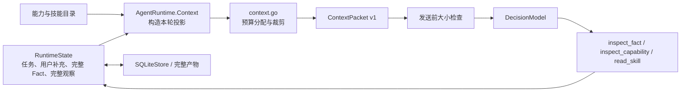

# 上下文管理：预算、投影与恢复

Agenstra 完整保存运行状态，每轮构造有界模型视图，并通过检查决策按需读取细节。上下文预算由 `context.go` 与 `AgentRuntime.Context()` / `Step()` 分配。跨运行记忆由 Host 和 SQLite 管理，并共享上下文预算；学习规则、宿主管理接口、快照失效与保留边界见[记忆设计与宿主管理](memory-management.md)。

## 1. 框架中的职责分配



`RuntimeState` 和完整 Fact 是执行、审计及恢复的依据。`ContextPacket` 是本轮模型视图：构建它不删除、改写或压缩持久状态。恢复后的相同状态会按相同规则重新构造上下文；引用有效性仍按当前时间和连接身份重新检查。

上下文投影使用 `agenstra.context.v1`，模型决策使用 `agenstra.decision.v1`。

## 2. 预算与保留顺序

预算度量为：

```text
utf8.RuneCountInString(systemPrompt) + utf8.RuneCount(CanonicalJSON(packet))
    <= MaxContextCharacters
```

`Step()` 在添加修复反馈、重复调用提醒和数组检查提示后再次分配预算；度量与现有 HTTP 模型适配器的两条消息正文一致。它计入 JSON 转义、Fact 来源、遗漏路径和遗漏说明，但不代表模型的 token 容量，也不包含模型输出预算。

正常情况下，全部有界预览、最近 12 条观察与已加载技能都能放入预算，直接保留。每个 Fact 预览仍以 6,000 字符为上限；过长观察参数仍通过 `arguments_omitted` 标记。

发生压力时，先建立保留必需信息的基础视图：

| 信息 | 保留规则 |
| --- | --- |
| 系统说明、原任务、所有用户补充 | 完整保留。 |
| Fact 身份与来源 | 保留全部 ID、来源版本、时间、引用作用域、失效时间和 `reference_available`。 |
| 当前 `inspected_fact` / `inspected_capability` | 完整保留已有检查视图或完整 schema，避免检查内容被立即挤掉。Fact 检查视图本身仍有界。 |
| 最新加载的技能 | 完整保留；重新 `read_skill` 会把该技能移到最新位置。 |
| 最新观察结果 | 至少保留最后一次状态、Fact ID 或错误码。参数可通过标记省略。 |

可恢复信息按下面的顺序回收：

1. 暂时移出较旧的长技能，记录 `skill: NAME; read_skill to load again`。如果一段短技能比遗漏说明更小，直接保留。
2. 为最新 Fact 的有界预览预留空间，从最旧观察开始省略参数，保持调用结果与错误码。完整参数仍在原状态与审计记录中。
3. 若仍不足，按输入 schema 大小将能力目录改为名称、字段名和 `schema_requires_inspection` 标记。所有能力身份、描述、授权与执行元数据继续保留；当前检查出的完整 schema 不参与裁剪。
4. 从最旧端缩短观察窗口，更新准确的遗漏数量，保留最新一次结果。
5. 若必需视图仍超限，减少可选的数组长度提示；每个 Fact 的 `omitted_paths` 继续保留。
6. 将剩余空间按 Fact 从新到旧分配预览。每个候选都测量整个包的实际序列化大小，包括遗漏路径的额外开销；候选超限时降低其预览预算。
7. 使用剩余空间重新放回较旧技能，并撤回已恢复技能的遗漏说明。

预留近期预览是软目标。如果必需信息可以放下，但完整近期预览放不下，仍尝试提供更小的明确部分视图。原任务、用户补充、身份目录或当前检查内容等必需信息本身无法放下时，沿用 `context_too_large`，在增加模型轮次、调用模型之前失败。不能通过悄悄删除任务约束让请求看起来符合预算。

## 3. Fact 预览与恢复语义

Fact 预览计算对象和数组的结构开销以及标量替代值。整体能放下时保留原值；过大的数组保留最多 32 个原始位置的样本，遗漏的数组元素可用带路径标记的 `null` 占位；无法容纳的对象字段直接省略，避免被误认作真实的 `null` 或空值。其余缺失部分通过 `omitted_paths` 明示。过大的字符串不截成貌似完整的引文。

零预算仍需要 `{}` 作为合法对象，最小为两个字符，并用 JSON 根路径 `[]` 表示整个值被省略。`omitted_paths`、Fact 元数据的大小由整个上下文包的预算另行计算。

完整恢复沿用已有决策：

- `inspect_fact(fact_id, path)` 从完整 Fact 中选取路径，再提供有界检查视图；遗漏路径相对于检查视图的 `value` 包装。
- `$fact_value` 在执行工具调用前解析完整原始值，因此传参不受模型预览裁剪影响。
- `inspect_capability(name)` 获取完整契约，`read_skill(name)` 重新加载技能。
- `reference_available=false` 表示引用不可继续使用；历史证据保留不等于恢复连接内 ID 或过期引用的有效性。

启用 `max_context_capabilities` 后，运行先选择数量受限的授权能力，优先提供这些能力的完整输入 Schema；整份上下文预算不足时才缩略契约并保留 `schema_requires_inspection` 标记。`search_capabilities(query)` 在当前固定版本及实时授权范围内检索名称、描述和完整输入 Schema 中的字段、`const` / `enum` 字符串及参数说明，包括联合分支和嵌套参数。它只读取目录，不调用业务接口；命中能力进入下一轮目录，仍被缩略的契约通过 `inspect_capability` 展开。宿主应在模块描述中保留可执行操作名和业务词汇，避免大 Schema 延迟展开后只剩“修改”等笼统说明。空搜索结果只表示当前查询没有授权匹配，不能推断宿主不支持该操作或用户没有权限；历史回答也不能覆盖当前目录。未启用目录数量限制时，沿用原有 `ModelView` 的 2,000 字符缩略规则。

这个取舍参考了 [OpenAI Tool Search](https://developers.openai.com/api/docs/guides/tools-tool-search)、[Anthropic Tool Search](https://platform.claude.com/docs/en/agents-and-tools/tool-use/tool-search-tool) 和 [Pydantic AI Tool Search](https://pydantic.dev/docs/ai/capabilities/tool-search/) 的按需发现机制。框架沿用已有 JSON 决策与本地搜索，不要求供应商原生工具搜索；相比 [LangChain LLM Tool Selector](https://docs.langchain.com/oss/python/langchain/middleware/built-in#llm-tool-selector)，这里无需每轮增加一次模型筛选请求。词法搜索的召回取决于宿主描述和查询词，仍须在实际模型上验收，不能把单次无匹配当成完整能力审计。

多主题任务按已有决策记录保留近期查看过的能力和历史搜索的首个匹配，避免后一主题的搜索立即覆盖前一主题的工具。最新搜索的首个结果优先进入目录；其余位置先给当前检查和近期发现，再按最新搜索及原任务补充，全部遵守 `max_context_capabilities` 和实时授权。框架从固定发布版本重新解析这些契约，不保存第二份工具目录；字符和 token 预算仍可缩略非当前检查的 Schema。这个取舍对应成熟系统保留已发现工具引用的做法，使用现有决策状态，无需新增模型请求或宿主接线。

上一条模型观察为 `capability_unknown` 时，下一轮提示会明确该调用未执行，要求按当前授权目录的确切名称选择能力，并区分 `tool_batch` 中的业务调用与独立的框架决策。能力搜索仍受 `runtime_features` 约束，不猜测别名、不增加授权，也不把错误调用自动转换成执行。此反馈参考 [Pydantic AI 的未知工具纠正机制](https://github.com/pydantic/pydantic-ai/blob/72d89d136b5d155e52f5c2b054175420459fb6f4/docs/retries.md#tool-retries)；Agenstra 沿用已有模型轮次、工具调用与停滞预算。

全部 Fact 身份、能力目录和技能目录都必须保留；最小元数据本身超限时，运行明确失败。字符预算不代表供应商的 token 容量，模型质量、延迟和费用需要在部署方选择的模型上评估。

## 4. 长任务进度与停滞检测

`ContextPacket.progress` 从完整观察与待执行调用生成已完成、待处理和阻塞摘要。成功结果按 capability 保留最近一次 Fact 引用，每类最多 8 条，提供完整计数与省略数量；即使早期结果已离开最近 12 条观察窗口，仍可通过引用检查。运行中的异步操作不会计为已完成。摘要不改写完整状态，也不生成未经验证的任务计划。预算压力下先精简摘要，保留计数和停滞提醒。

异步动作已关联同一 invocation 的当前轮询 Fact 时，模型观察和进度只保留原动作及该 Fact 引用，避免把框架轮询再计成一次完成。缺少原动作的轮询仍可见；失败、待处理和不确定结果保持原语义。完整轮询观察与原 Fact 继续保存在审计记录中。

默认连续 8 个决策没有新证据时以 `agent_stagnated` 停止，Host 可用 `max_stagnant_rounds` 调整（0 使用默认值）。提前两轮提供 `stagnation_warning`。新结果内容、首次有效 schema/Fact 路径检查、首次技能加载和新用户补充会重置计数；更换调用/Fact ID、重复相同结果或循环检查已读路径不会。计数与检查摘要持久化，因此重启不会清零。原有模型轮次、工具次数和 token 预算继续独立生效。

对成功的浏览器只读动作，以原动作能力和回执中的业务 `result` 判断信息增量，不把每次投递产生的新 `command_id` 当作进展；检查同一业务结果的相同路径也遵守此规则。新的写操作、变化的业务结果、普通 provider 的业务 ID 和没有动作关联的轮询保留完整判断依据，不按只读投递 ID 归一化。

该检测衡量可观察的证据进展。持续变化的上游数据可能持续重置计数，仍由总预算约束；它不判断业务目标是否完成，业务验收由 completion validator 负责。
