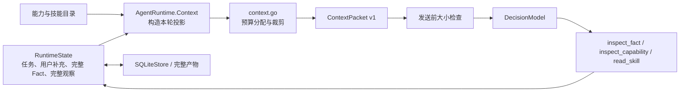

# 上下文管理：调研、设计与实现

调研日期：2026-10-01。

本文记录上下文预算优化的独立变更。后续跨运行记忆已通过 Host 和 SQLite 实现，并共享本轮上下文预算；学习规则、宿主管理接口、快照失效与保留边界见[记忆设计与宿主管理](memory-management.md)。

Agenstra 适合采用**完整状态持久保存、每轮构造有界视图、细节按需检查**的上下文管理方式。框架已经有 Fact、运行检查点、技能目录和检查决策，本次优化集中在 Go 内核的 `context.go` 与 `AgentRuntime.Context()` / `Step()` 的预算分配，不增加新的运行层。

## 1. 互联网与 GitHub 调研

以下结论来自实际读取的官方文章、文档和 GitHub 文件。GitHub 链接固定到本次读取的提交，便于复查；项目热度不作为正确性证据。

| 来源 | 值得借鉴的做法 | 对 Agenstra 的适用性 |
| --- | --- | --- |
| [Anthropic：Effective context engineering](https://www.anthropic.com/engineering/effective-context-engineering-for-ai-agents) | 用轻量标识定位外部资料，按需加载；压缩历史时保留关键约束与近期材料；先清理重复工具结果等低风险内容。 | Fact ID、路径检查与完整结果分离符合这种模式。优先减少重复内容，再考虑生成摘要。 |
| [LangGraph：Memory overview](https://docs.langchain.com/oss/python/langgraph/memory) | 将单个对话的检查点状态与跨对话、按命名空间隔离的长期记忆分开；持久状态不必全部进入模型。 | `RuntimeState` / `SQLiteStore` 与 `ContextPacket` 已具备相应边界。当前任务的恢复需求不需要引入跨任务记忆。 |
| [Deep Agents：summarization middleware](https://github.com/langchain-ai/deepagents/blob/839ccee06c98a04b4b90ac69af32513b920091e5/libs/deepagents/deepagents/middleware/summarization.py) | 按模型容量或阈值触发压缩，保留近期窗口，先精简旧工具参数；把原始历史卸载到后端以供恢复。 | 借鉴近期信息优先、参数降级和完整历史保留。Agenstra 的结构化观察可确定性裁剪，不需要额外调用摘要模型。 |
| [Pi：compaction reference](https://github.com/earendil-works/pi/blob/e792ba131ed0495f3ff58a0eb13f20540e344d5c/packages/coding-agent/docs/compaction.md) 与 [实现](https://github.com/earendil-works/pi/blob/e792ba131ed0495f3ff58a0eb13f20540e344d5c/packages/coding-agent/src/core/compaction/compaction.ts) | 在下一轮前检查实际投影，预留输出 token，保留近期消息；摘要记录目标、约束、进度、阻塞、决策和准确引用，原始条目仍保存。 | 每轮发送前检查投影值得直接采用。结构化摘要与输出 token 预留可作为未来模型适配器能力，不能把字符预算当作 token 预算。 |
| [OpenAI Agents SDK：compaction session 实现](https://github.com/openai/openai-agents-python/blob/28e9f4fca26dd1c7e679398b87182868ecfad714/src/agents/memory/openai_responses_compaction_session.py) | 选择可压缩条目时排除用户消息；处理模型视图与完整历史的差异；压缩替换需要考虑一致性与失败恢复。 | 原任务和用户补充必须保留。当前选择纯视图重建，避免将有损摘要写回运行状态。 |
| [Letta：stateful agents / memory](https://docs.letta.com/guides/agents/memory/) | 区分固定在上下文中的核心记忆与可检索历史；从上下文中移出的消息仍可读取。 | 适合借鉴“保留当前必需信息、允许旧材料重新加载”的原则。跨任务记忆块需要另外定义权限、保留期和来源。 |

本次通过 GitHub repository search 检索了 Deep Agents、Pi、OpenHands 和 Letta，并通过仓库树定位实际实现文件。OpenHands 主仓库的上下文相关代码主要是操作入口，因此实现对照采用了可直接读取的 Deep Agents、Pi 和 OpenAI Agents SDK 文件。Pi 原来的 `badlogic/pi-mono` 地址已重定向到 `earendil-works/pi`，这里使用解析后的仓库名。

OpenAI Docs 官方站点的 context management / conversation state 页面在本次环境中返回 HTTP 403，因此没有依据这些未成功读取的页面推断当前 API 行为。上表的 OpenAI 结论只来自实际读取的 SDK 源码。

## 2. 原实现的具体问题

原流程为：固定保留最近 12 条观察；为所有 Fact 平均分配总字符预算的三分之一；超过预算时清空所有 Fact 预览，再逐个移出旧技能。

这个流程存在几个可复现的问题：

- 大量不足 2,000 字符的观察参数仍可累计超限。清空 Fact 预览后，没有继续精简参数或历史，导致可恢复的运行被 `context_too_large` 终止。
- 一次性清空预览没有区分近期证据和旧证据；即使剩余空间能保留新结果，也不会重新分配。
- 单个输入 schema 未达到 2,000 字符时直接内联；多个小 schema 的总量仍可能超限。
- 运行检查前添加的修复反馈和数组检查提示会占用额外空间，原投影没有按最终系统消息重新分配预算。
- 最新读取的技能也可能立即被移出上下文，模型再次读取时仍然丢失，形成无进展的加载循环。

回归场景使用 12 个 Fact，每个含 ID 与 1,500 字符正文，12 条观察各含 1,700 字符查询参数。在 9,000 字符预算下，当前 Go `main` 的旧实现产生 **26,557 字符**的模型输入，且清空全部 Fact 预览。本次复测的 Go 新实现为 **8,073 字符**，保留全部 12 个 Fact 身份、12 条观察状态和最新结果的完整 1,500 字符正文；完整原始查询参数仍在状态中。可执行用例见 `context_budget_test.go`。

## 3. 框架中的职责分配



`RuntimeState` 和完整 Fact 是执行、审计及恢复的依据。`ContextPacket` 是本轮模型视图：构建它不删除、改写或压缩持久状态。恢复后的相同状态会按相同规则重新构造上下文；引用有效性仍按当前时间和连接身份重新检查。

本次继续使用现有 `agenstra.context.v1`、`agenstra.decision.v1` 与状态 schema version 1。没有增加数据库字段、迁移、生产依赖、配置项或新的模型调用。

## 4. 预算与保留顺序

预算度量为：

```text
utf8.RuneCountInString(systemPrompt) + utf8.RuneCount(CanonicalJSON(packet))
    <= MaxContextCharacters
```

`Step()` 在添加修复反馈、重复调用提醒和数组检查提示后再次分配预算；度量与现有 HTTP 模型适配器的两条消息正文一致。它计入 JSON 转义、Fact 来源、遗漏路径和遗漏说明，但不代表模型的 token 容量，也不包含模型输出预算。

正常情况下，全部有界预览、最近 12 条观察与已加载技能都能放入预算，直接保留。每个 Fact 预览仍以 6,000 字符为上限；过长观察参数仍通过 `arguments_omitted` 标记。

发生压力时，先建立保留必需信息的基础视图：

| 信息 | 保留规则 |
| --- | --- |
| 系统说明、原任务、所有用户补充 | 完整保留。 |
| Fact 身份与来源 | 保留全部 ID、来源版本、时间、引用作用域、失效时间和 `reference_available`。 |
| 当前 `inspected_fact` / `inspected_capability` | 完整保留已有检查视图或完整 schema，避免检查内容被立即挤掉。Fact 检查视图本身仍有界。 |
| 最新加载的技能 | 完整保留；重新 `read_skill` 会把该技能移到最新位置。 |
| 最新观察结果 | 至少保留最后一次状态、Fact ID 或错误码。参数可通过标记省略。 |

可恢复信息按下面的顺序回收：

1. 暂时移出较旧的长技能，记录 `skill: NAME; read_skill to load again`。如果一段短技能比遗漏说明更小，直接保留。
2. 为最新 Fact 的有界预览预留空间，从最旧观察开始省略参数，保持调用结果与错误码。完整参数仍在原状态与审计记录中。
3. 若仍不足，按输入 schema 大小将能力目录改为名称、字段名和 `schema_requires_inspection` 标记。所有能力身份、描述、授权与执行元数据继续保留；当前检查出的完整 schema 不参与裁剪。
4. 从最旧端缩短观察窗口，更新准确的遗漏数量，保留最新一次结果。
5. 若必需视图仍超限，减少可选的数组长度提示；每个 Fact 的 `omitted_paths` 继续保留。
6. 将剩余空间按 Fact 从新到旧分配预览。每个候选都测量整个包的实际序列化大小，包括遗漏路径的额外开销；候选超限时降低其预览预算。
7. 使用剩余空间重新放回较旧技能，并撤回已恢复技能的遗漏说明。

预留近期预览是软目标。如果必需信息可以放下，但完整近期预览放不下，仍尝试提供更小的明确部分视图。原任务、用户补充、身份目录或当前检查内容等必需信息本身无法放下时，沿用 `context_too_large`，在增加模型轮次、调用模型之前失败。不能通过悄悄删除任务约束让请求看起来符合预算。

## 5. Fact 预览与恢复语义

沿用 Go `main` 已有的预览构造：计算对象和数组的结构开销以及标量替代值。整体能放下时保留原值；过大的数组保留最多 32 个原始位置的样本，遗漏的数组元素可用带路径标记的 `null` 占位；无法容纳的对象字段直接省略，避免被误认作真实的 `null` 或空值。其余缺失部分通过 `omitted_paths` 明示。过大的字符串不截成貌似完整的引文。

零预算仍需要 `{}` 作为合法对象，最小为两个字符，并用 JSON 根路径 `[]` 表示整个值被省略。`omitted_paths`、Fact 元数据的大小由整个上下文包的预算另行计算。

完整恢复沿用已有决策：

- `inspect_fact(fact_id, path)` 从完整 Fact 中选取路径，再提供有界检查视图；遗漏路径相对于检查视图的 `value` 包装。
- `$fact_value` 在执行工具调用前解析完整原始值，因此传参不受模型预览裁剪影响。
- `inspect_capability(name)` 获取完整契约，`read_skill(name)` 重新加载技能。
- `reference_available=false` 表示引用不可继续使用；历史证据保留不等于恢复连接内 ID 或过期引用的有效性。

## 6. 验证与实际边界

`context_budget_test.go` 覆盖观察累计超限、近期证据保留、当前检查与技能恢复、能力目录降级、准确遗漏计数、引用失效、状态不变与序列化恢复、重试反馈的总预算，以及必需信息超限时禁止模型 IO。`runtime_test.go` 继续验证数组完整长度提示、真实空值与被省略字段的区别，以及中文按 Unicode 字符而非字节计量。检查点恢复使用实际 `CanonicalJSON` 投影比较，允许 Go 空切片与 `nil` 在内存表示上的差异。

验证命令与现有 CI 一致：`gofmt` 检查、`go test -race ./...`、`go vet ./...`、`go build ./cmd/...` 和 `npm test --prefix web`。

多轮回归还验证：读取四个较大结果 → 在裁剪后检查最早结果的 ID → 将最早结果中 9,000 字符的完整字段传给后续能力 → 收到真实结果并引用 Fact 完成。这个场景同时检查模型视图有界、传参使用完整原值、完整审计参数仍然保存。

测试使用模型与 Provider 替身，不验证真实模型的回答质量、成本或供应商 token 上限。当前仍保留全部 Fact 身份、能力目录和技能目录，因此这些最小元数据本身超限时会明确失败；本次不承诺无限长运行。

未来若有代表性任务证据，可分别评估：模型适配器提供准确 token 计量与输出预留；可追溯的结构化历史摘要；带 owner / connection 隔离与保留策略的长期记忆；大目录的分页检索。它们需要单独定义契约与验收指标，本次没有提前引入。
