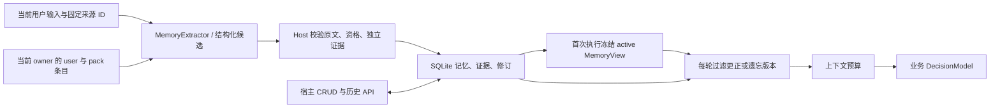

# 记忆：自动学习与宿主管理

调研与实现日期：2026-10-01。

记忆保存同一用户跨运行使用的偏好、长期约束和项目约定。用户明确表达的长期规则立即生效；没有说“以后”或“记住”，但在 **3 个独立输入中表现出相同选择**的习惯，也自动成为默认偏好。宿主通过公开 Go 方法、认证后的 HTTP API 和 JS SDK 管理同一份记忆。

## 1. 调研取舍

本次实际读取的官方文档和 GitHub 源码如下。源码链接固定到读取的提交。

| 来源 | 借鉴的机制 | Agenstra 第一版的取舍 |
| --- | --- | --- |
| [LangGraph memory](https://docs.langchain.com/oss/python/concepts/memory) 与 [Store](https://github.com/langchain-ai/langgraph/blob/b36b1d58a8b408455b512cfad3b1b26e02927282/libs/checkpoint/langgraph/store/base/__init__.py) | 会话检查点与跨会话 Store 分开，按命名空间管理。 | 记忆独立于 RuntimeState、Fact 和聊天历史，按认证 owner 与 pack 隔离。 |
| [Letta memory blocks](https://docs.letta.com/v1-sdk/memory/memory-blocks) | 用可编辑的有界记忆块提供长期信息。 | 宿主拥有 CRUD 与历史接口；模型只接收有界 MemoryView。 |
| [Mem0 memory](https://github.com/mem0ai/mem0/blob/94c3fe9f238f3dbf29c9ce98643bd71eb13077cd/mem0/memory/main.py) 与 [prompts](https://github.com/mem0ai/mem0/blob/94c3fe9f238f3dbf29c9ce98643bd71eb13077cd/mem0/configs/prompts.py) | 分阶段提取、更新、删除并保留变更历史。 | 模型提出候选，Host 校验来源，在 SQLite 事务中提交；修改用 revision 防止丢失更新。 |
| [Graphiti edges](https://github.com/getzep/graphiti/blob/3c427640abf909f12f71f963fce15eb514a3c493/graphiti_core/edges.py) 与 [maintenance](https://github.com/getzep/graphiti/blob/3c427640abf909f12f71f963fce15eb514a3c493/graphiti_core/utils/maintenance/edge_operations.py) | 用有效、失效和过期时间处理关系变化与冲突。 | 实现版本和旧投影失效；暂不引入图谱或自动到期规则。 |
| [OpenViking memory API](https://github.com/volcengine/OpenViking/blob/39a39e80cc830aac1aa71019e6e292356953378a/docs/zh/api/16-memory.md) 与 [updater](https://github.com/volcengine/OpenViking/blob/39a39e80cc830aac1aa71019e6e292356953378a/openviking/session/memory/memory_updater.py) | 把长期信息组织为可维护条目，区分新增和更新。 | 用稳定 topic key 合并等价表达，避免重复偏好。 |
| [Hindsight retain](https://hindsight.vectorize.io/developer/api/retain) 与 [reflect](https://hindsight.vectorize.io/developer/reflect) | 区分保存信息和基于记忆形成回答。 | 学习与业务决策分开，提取失败有诊断且不阻断业务任务。 |

第一版复用 Go 和 SQLite，不增加向量数据库、生产依赖或新服务。记忆用于少量结构化默认值。OpenAI 官方文档请求返回 403，Anthropic memory 页面转至地区不可用页面，未把这些未读内容作为设计证据。

## 2. 学习规则与作用域

| 输入/操作 | 结果 |
| --- | --- |
| “请用中文写这份报告”，3 个独立输入表现出相同选择 | 前两次为 `candidate`，第三次自动变为 `active`，无需确认。 |
| “以后报告用英文”或明确更正长期规则 | `explicit`，立即生效并使旧版本投影失效。 |
| “这次报告用英文” | `temporary`，只影响本次任务。Host 还排除带常见临时限定词的 habit 输入。 |
| 宿主 `SetMemory` | `manual`，立即生效。自动推断的偶然相反选择不能替换 manual/explicit 默认值。 |
| “忘记报告语言偏好”或宿主 `DeleteMemory` | 清除记忆值、证据和旧修订内容，保留无内容的 `forgotten` 条目及失效版本。 |

`kind` 为 `preference`、`constraint`、`convention`。习惯推断只能生成 preference；约束和项目约定必须来自明确表达或宿主管理。相反习惯要重新积累 3 次证据才能替换已有推断值。更正会提高证据起点；遗忘后恢复自动默认值需要 3 次新观察，重放以前的输入不能累计。

`scope=user` 是该 owner 的通用默认值，pack_id 为空；`scope=pack` 是该 owner 在当前能力包下的约定。本版用 pack 表达项目/领域边界，不提供跨用户团队政策。同 key 的 active pack 条目覆盖 active user 条目。candidate/forgotten 不注入模型。

key 必须匹配 `^[a-z][a-z0-9_.-]{0,63}$`，例如 `report.language`、`report.format`、`measurement.units`、`project.api_changes`；value 最多 500 个 Unicode 字符。

自动提取只读取当前用户输入。聊天传入当前消息 text，不把助手回答或重建的历史指令重新当作证据。Host 的 SupplyInput 是另一个来源。请求重放、模型重试和恢复不增加证据；定时任务按任务 ID、pack 与指令内容确定来源，重复 tick、暂停和恢复只计一次。

“独立”指不同输入来源 ID，不是统计置信度。3 次阈值是本版产品规则；长期意图判断、等价表达归一化和 topic 选择仍取决于模型质量。Host 要求每条候选含当前输入的真实原文片段，最多 8 条，拒绝重复 topic、伪造引用、未知字段和习惯推断硬约束。提取提示排除引文、第三方表述、工具输出、凭据与当前业务状态；这不是敏感信息检测器。

## 3. Go 宿主接口

公开方法复用当前 owner/pack 的授权检查：

```go
items, err := host.ListMemories(ctx, ownerID, packID, 100, 0)
item, err := host.GetMemory(ctx, ownerID, packID, memoryID)
history, err := host.MemoryHistory(ctx, ownerID, packID, memoryID)

// 新建 revision=0；已有 key 的更新必须带当前 revision。
item, err = host.SetMemory(ctx, ownerID, packID, agenstra.MemoryUpdate{
    Scope: "user", Key: "report.language", Value: "zh-CN",
    Kind: "preference", Revision: 0,
})
item, err = host.SetMemory(ctx, ownerID, packID, agenstra.MemoryUpdate{
    Scope: item.Scope, Key: item.Key, Value: "en",
    Kind: item.Kind, Revision: item.Revision,
})
forgotten, err := host.DeleteMemory(ctx, ownerID, packID, item.ID, item.Revision)
```

调用方必须处理每次错误，成功后才使用返回的 revision。ownerID 应来自宿主认证身份。ListMemories 包含当前 pack 和 user 条目，也包含 candidate/forgotten，方便管理列表；limit 为 1–1000，offset 不得小于 0。

Memory 返回 id、scope、pack_id、key、value、kind、status、origin、revision、evidence_count、source_id、quote、created_at、updated_at。MemoryHistory 返回最新在前、分别最多 100 条的 revisions 和 evidence；未采用的相反习惯也能在 evidence 中查看。宿主设定的值通过 manual 修订记录来源。

## 4. HTTP API

服务端凭据使用现有用户 `Authorization: Bearer ...`；身份从凭据解析。响应设置 `Cache-Control: no-store`。

| 方法与路径 | 参数/行为 |
| --- | --- |
| `GET /memories?pack_id=records&limit=100&offset=0` | 列出当前 owner 的 user 与 records 条目。 |
| `POST /memories` | JSON 传 pack_id、scope、key、value、kind、revision，按作用域/key 创建或更新。pack_id 也可放在 query；两处必须一致。 |
| `GET /memories/{id}?pack_id=records` | 获取条目。 |
| `DELETE /memories/{id}?pack_id=records` | JSON `{"revision":当前版本}`，执行遗忘并返回空值条目。 |
| `GET /memories/{id}/history?pack_id=records` | 查看修订与证据。 |

```sh
curl -X POST http://127.0.0.1:8091/memories \
  -H "Authorization: Bearer $AGENT_OPERATOR_API_KEY" \
  -H 'Content-Type: application/json' \
  -d '{"pack_id":"records","scope":"pack","key":"project.api_changes","value":"修改公共接口前先讨论","kind":"constraint","revision":0}'
```

旧版本修改/删除返回 `409 revision_conflict`，宿主应重新读取后处理冲突；跨 owner 或访问其他 pack 私有条目返回 404。无认证返回 401，pack 授权不允许返回 403，非法输入返回 422。不提供 owner_id 的 body 参数。

Web 入口使用 `/web/v1/memories`，每条请求的 query 传 integration_id，其余契约相同。owner 来自短期票据，pack 来自服务端 integration 配置；其他 pack_id 会被拒绝。复用现有 origin 和票据认证，无需 browser key、页面观察或 conversation ID。需启用现有 Web 集成，无需创建浏览器会话。短期票据不能访问服务端 `/memories`。

## 5. JS SDK

宿主沿用已认证的客户端，无需恢复上下文或提交历史消息：

```js
const memories = await client.listMemories({ limit: 100, offset: 0 });
const saved = await client.setMemory({
  scope: "user", key: "report.language", value: "zh-CN",
  kind: "preference", revision: 0
});
const current = await client.getMemory(saved.id);
const history = await client.memoryHistory(saved.id);
await client.deleteMemory(current.id, current.revision);
```

方法复用 ClientOptions.integration 和 getSession()，包括票据续期和请求取消；TypeScript 同步提供 Memory、MemoryUpdate、MemoryHistory。宿主可实现自己的列表和编辑界面，框架不预设 UI。

## 6. 执行、预算与遗忘边界



HTTPJSONDecisionModel 实现可选的 MemoryExtractor。每个未处理来源在业务决策前增加一次提取请求，使用同一模型适配器和超时。自定义模型可实现该接口；没有实现时仍可通过宿主保存/使用记忆。提取与业务决策是不同调用，不计入业务 ReAct 轮数。

提取预检计入固定提取提示和 canonical JSON 的 Unicode 字符数，遵守 HostSettings.MaxContextCharacters；已有条目最多提供 32 条辅助信息，可按预算移除，完整当前输入不可截断。仍超限时不进行模型 IO。提取错误、非法输出和超限记录在运行 envelope 的 memory_errors 中，业务任务继续；失败来源不会在每次恢复时无限重试。

模型 IO 在 SQLite 事务外发生。来源去重、证据和修订原子提交，并检查运行租约；丢失租约的 worker 不能保存结果。首次执行冻结 memory_snapshot，恢复期间新增记忆不改变快照。每次业务模型调用前过滤已更正/遗忘的旧版本；更正值参与新运行，当前补充由原有 Followups 保留。

投影只携带 ID、key、value、kind、scope、revision，不复制来源历史。当前用户要求优先于历史默认值；记忆不能授予能力、批准操作、作为业务 Fact 或复活旧 Fact 引用。严重预算压力下可省略偏好并在 context_omissions 说明数量；约束和项目约定保留，放不下则在模型 IO 前失败为 context_too_large。计量是字符预算，尚无精确 token/输出预留。

遗忘清除记忆表中的 value、quote、source_id、evidence 和旧修订内容，保留主题标识、无内容 tombstone 和失效版本，阻止重放恢复旧证据。原始对话、运行 instruction、旧 memory_snapshot 和其他审计记录仍属于原有保留范围；遗忘不是对这些记录、SQLite 备份或磁盘历史的物理擦除。后续调用过滤旧 snapshot，原始审计保留策略由部署方另行管理。

本版没有自动过期、向量检索、跨用户团队记忆、管理 UI 或批量历史回填。独立 agenstra CLI 直接调用 AgentRuntime，不具备持久 owner/store；跨运行自动记忆使用 AgentHost、agenstra-serve 或基于 Host 的 Web 集成。

## 7. 验证范围

回归覆盖三次自动采用、显式更正、临时例外、输入重放、恢复、owner/pack 隔离、pack 优先、并发 revision 冲突、遗忘和旧快照失效、聊天只学习当前消息、定时任务重复去重、提取失败不阻断、丢失租约、预算和 IO 预检，以及 HTTP/Web/SDK 管理契约。

测试使用 SQLite、模型替身和 httptest 的真实 HTTP 适配器协议。未调用真实模型；中文/英文提取准确率、归一化效果、延迟和成本需在部署方选择的模型上验收。

跨项目任务可通过可选 `sources` 明确选择目标能力，并按发起项目委派、目标验证权限和任务范围取交集。目标身份、实际凭据、版本固定、项目记忆和各入口的完整接入说明见[跨项目任务、身份与授权](cross-project-tasks.md)。所有读取与轮询也必须明确授权。
