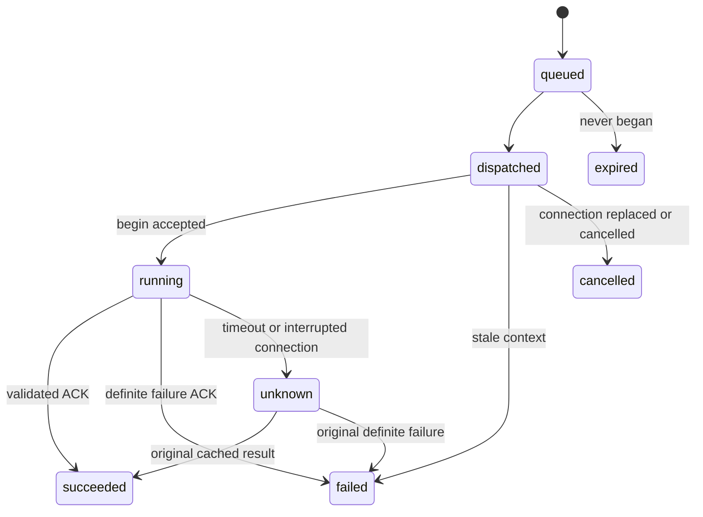

# 可选聊天接口、会话管理与前端控制桥

本模块提供无 UI 的聊天与会话接口、框架管理的 Agent 上下文、浏览器 SDK、动作投递和回执恢复。宿主系统自行设计所有聊天界面，只需接入自己的业务 API、登录身份、页面观察数据与 UI handler。宿主通过会话 ID 选择会话；上下文的读取、组装、持久化和任务恢复由框架负责。核心包不包含 DOM 渲染、聊天 Web Component 或 CSS，也不依赖 React/Vue。模块默认关闭，不修改 v1 运行库结构，原 `/runs` 和 `/admin` 的认证方式保持原样。部署范围是单节点、本地持久磁盘和 SQLite WAL。

## 运行完整示例

在仓库根目录执行 `go run ./examples/web-integration`，访问 `http://127.0.0.1:8092`。示例使用明确标注的演示订单和固定 `DecisionModel`，无需模型密钥；通过框架 REST Provider 查询实际的本地 HTTP 接口，再执行浏览器 handler，收到回执才完成任务。

- “显示待处理订单”：查询后端，再更新列表和筛选条件。
- “打开订单 1001”：批准精确参数后才打开详情。
- “体验补充信息”：先追问，再根据输入更新列表。
- 连续发送消息可观察 FIFO 排队；可以停止排队或执行中的任务。
- 新建或选择会话，观察各自的历史与任务状态；切换会话不会取消旧任务。

示例聊天 UI 位于 `examples/web-integration/demo-chat.js`，仅由示例服务提供，不属于 SDK 导出或框架静态资源。示例只监听回环地址，身份固定为 `demo`，退出时删除临时数据库。生产环境须用宿主已经验证的登录会话解析身份，并使用真实模型、业务数据和持久存储。

## 选择要复用的模块

| 方式 | 配置 | 复用内容 |
| --- | --- | --- |
| 接入聊天 | `chat: true`, `browser_bridge: false` | 聊天/会话接口、框架上下文和 SDK；调用后端能力 |
| 聊天并控制页面 | 两项均为 `true` | 会话与上下文管理、浏览器控制桥 |
| 仅需控制桥 | `chat: false`, `browser_bridge: true` | SDK 的 `run()` 和浏览器动作 |

所有模式的 UI 均由宿主实现。

## 部署配置和授权

在现有 deployment JSON 增加以下片段。`records` 是已有后端包，`records-web` 是组合别名；相对路径基于 deployment 文件所在目录。

```json
{
  "web_integration": {
    "database_path": "/data/agent-web.sqlite3",
    "chat": true,
    "browser_bridge": true,
    "session_key_env": "AGENT_WEB_SESSION_KEY",
    "session_ttl_seconds": 900,
    "allowed_origins": ["https://app.example.com"],
    "integrations": {
      "records-web": {
        "pack_id": "records",
        "frontend_profile_path": "frontend-profile.json"
      }
    }
  }
}
```

`AGENT_WEB_SESSION_KEY` 是至少 32 字节的随机服务端秘密，可用 `openssl rand -hex 32` 生成。票据有效期默认 900 秒，可配置 60–3600 秒。`allowed_origins` 为不含路径的精确 HTTP(S) origin；直接同源请求自动允许。TLS 在反向代理终止时，显式配置外部 HTTPS origin。可使用同源 `/agent` 反向代理，代理去掉 `/agent` 前缀。

扩展库必须与运行库、管理库分开。备份和恢复时停止写入，同时保存各数据库和能力包，避免恢复到不一致的时间点。模块没有自动保留期清理。

对应用户增加 `"browser_actions": {"records-web": ["ui.navigate"]}`。用户仍须拥有 `users.<owner>.packs.records` 的有效连接及 `allow_model_data: true`。后端授权沿用现有配置。浏览器注册 handler 仅声明能执行的动作，服务端决定权限。Go 嵌入式服务可设置 `server.Web.ResolveBrowserActions`，实时读取宿主授权；先以 `workerEnabled=false` 构造服务器、设置 hook，再运行自己的 `Web.Tick` / `Host.WakeDue` 调度。不要在运行期间并发修改配置 map 或 hook。

仅聊天可配置 `"integrations": {"records": {"pack_id":"records"}}`，无需 profile。包含前端 profile 的 integration 必须使用独立别名，避免改变原包的能力目录。业务包不能使用保留的 `ui.*` 命名空间。

## 前端动作契约

一个最小 `frontend-profile.json`：

```json
{
  "schema": "agenstra.frontend-profile.v1",
  "version": "1.0.0",
  "handler_version": "1",
  "context_schema": {
    "type": "object",
    "properties": {"page": {"type": "string"}},
    "required": ["page"], "additionalProperties": false
  },
  "actions": [{
    "name": "ui.navigate",
    "description": "Open a supported application page",
    "input_schema": {
      "type": "object",
      "properties": {"page": {"enum": ["home", "orders"]}},
      "required": ["page"], "additionalProperties": false
    },
    "output_schema": {
      "type": "object",
      "properties": {"page": {"type": "string"}},
      "required": ["page"], "additionalProperties": false
    },
    "effect": "write", "approval_required": false, "timeout_seconds": 60
  }]
}
```

动作使用 `ui.*` 名称，输入输出须为 object Schema；effect 为 `read`、`write` 或 `destructive`，超时 1–300 秒，默认 60。审批由 profile 或实时 policy 的 `ApprovalCapabilities` 要求。`ui.get_context`、`ui.command_status` 保留给框架。页面观察数据最多 16 KiB，结果最多 64 KiB。profile 的 `context_schema`、浏览器对象的 `context` / `context_revision` 及模型能力 `ui.get_context` 保留现有契约名称，仅指当前页面观察数据，不是 Agent 会话上下文。

profile 由服务端发布，在线浏览器不能新增模型可用能力。组合 release 固定前端 profile 和后端 fingerprint。托管后端恢复不可变 release；静态后端契约或绑定发生变更时，旧组合 run 在执行前以 `web_base_contract_changed` 拒绝，不能静默接受新契约。新任务使用新版本。别名不能改绑到其他业务包，改绑时使用新别名。

handler 语义变化时更新 `handler_version` 和 profile 版本。注册版本必须匹配当前 profile；旧 run 保留原契约。页面重载不会将未确认的旧动作迁移到新 generation。恢复连接时若当前 profile digest 与旧会话不同，服务端在改变 generation 前返回 `browser_profile_changed`。SDK 发出 `connection: {status: "profile_changed"}`，并尝试按当前 handler 注册替代旧连接；仍有未结束任务或不确定动作时保留旧绑定并返回相应错误。

## 用宿主登录身份换短期票据

浏览器仅接收短期 web ticket，不接收长期 API key 或管理密钥。推荐宿主提供 `/api/agent-session`：验证现有 cookie/session 和宿主 CSRF，映射 Agenstra owner，在服务端用该用户的 API key 调用 `POST /web/v1/token`，仅返回 `{token, expires_at}`。

同一 Go 服务中也可设置 `server.Web.AuthenticateRequest`，由宿主登录中间件解析 owner。该 hook 只用于 mint ticket，不能信任浏览器自报的 user ID。`MintSession(owner)` 用于宿主已经验证身份的服务端代码。

Web ticket 只用于扩展路由以及该用户关联的聊天/浏览器 run，不能用于 `/runs`、`/admin` 或无关联的任务。浏览器会话另有随机 key，SDK 通过 `X-Agenstra-Browser-Key` 发送；key 不授予业务权限。

## 宿主使用无 UI 的 SDK

SDK 资源嵌入 Go 二进制，无需静态资源构建；也可将 `web/agenstra-client.js` 纳入宿主 bundler。目录附 TypeScript 声明，`web/package.json` 当前为 private，未发布 npm 包，仅导出 `@agenstra/web/client`。

宿主希望离线构建或固定 SDK 版本时，在框架仓库执行 `node web/export-client.mjs /path/to/host/vendor/agenstra`。它复制原始 JS 和 TypeScript 声明，并生成包含 SHA-256 的 `agenstra-sdk.json`；宿主可从本地 vendor 目录导入。升级时重新导出并审查差异，不需要新增 npm 依赖，也不需要复制聊天 UI。

```js
import { createAgenstraClient } from "/agent/web/assets/agenstra-client.js";

const client = createAgenstraClient({
  endpoint: "/agent", integration: "records-web",
  browser: true, handlerVersion: "1",
  getSession: async () => {
    const response = await fetch("/api/agent-session", {
      method: "POST", credentials: "same-origin"
    });
    if (!response.ok) throw new Error("Login required");
    return response.json();
  },
  // 宿主提供当前页面信息；框架决定如何作为工具数据使用。
  getPageObservation: () => ({ page: hostRouter.currentPage() })
});
client.registerActions({
  "ui.navigate": async ({ page }, { commandId }) => {
    await hostRouter.navigate(page);
    return { page };
  }
});

const conversations = await client.listConversations();
// 宿主只选择会话 ID，不读取或提交 Agent 上下文。
if (conversations.length) await client.selectConversation(conversations[0].id);
else await client.createConversation();

const stopWatching = client.watchConversation(snapshot => {
  // 由原系统自己的 React/Vue/其他 UI 实现展示。
  hostChatView.render(snapshot);
});
await client.send("查询待处理订单", { clientId: client.id() });
// 用户切换会话：await client.selectConversation(chosenConversationId);
// 用户新建会话：await client.createConversation();
// 手动页面变化：await client.updatePageObservation({ page: "orders" });
// 结束使用：stopWatching(); await client.destroy();
```

`hostRouter` 和 `hostChatView` 代表宿主已有的路由和 UI。SDK 不创建任何 DOM 或样式。React/Vue 中只需在相应生命周期创建 client、订阅状态和解除订阅。结束使用或切换登录用户时调用 `client.destroy()`。一个 tab 对同一 endpoint/integration 使用一个 client。默认 `sessionStorage` 保存所选会话 ID、tab 绑定和执行回执，不保存 Agent 会话上下文；可传 `storage: null`。禁用存储后仍可通过会话列表手动恢复，服务端仍阻止重复认领。

`listConversations()` 返回当前 integration 下该用户最近的最多 100 个会话。`selectConversation(id)` 验证会话归属和 integration，立即发布所选会话的历史及状态。切换失败保留此前选择；旧会话的迟到轮询不会覆盖新会话。选择和创建按调用顺序串行化。未显式选择时，`getConversation()` 恢复已保存的会话 ID；没有可用会话时自动创建。切换不取消、不迁移旧任务的浏览器绑定。浏览器连接受阻时，仍可读取、选择和创建会话、查看任务状态以及调用 `cancelMessage`；这些操作成功不代表浏览器已连接。`watchConversation` 同时尝试浏览器连接和聊天轮询，连接错误不阻止历史显示。启用控制桥的 `send` 和 `run` 必须先完成浏览器连接。

handler 在连接前注册，返回符合 output Schema 的结果；实际业务写入须在后端再次校验权限，可用 `commandId` 作为业务幂等键。`getPageObservation` 返回当前页面、筛选、选中项等数据，排除 cookie、token 和无关敏感数据；手动改变页面后调用 `updatePageObservation`。这些接口只能更新页面观察数据，不影响聊天历史、运行检查点或 Agent 上下文选择。

配置 `getPageObservation` 时，SDK 每次心跳检查页面变化，并在 handler 前后同步；内容不变时不增加页面版本。页面观察的外层 `revision` 仅用于浏览器桥。如果业务 API 自己有乐观锁版本，在观察和动作参数中使用不同字段名，例如 `activityRevision` 与 `expectedRevision`，并在能力说明中写清来源。每个批次执行一个宿主浏览器动作，下一宿主动作前读取一次 `ui.get_context`。一次成功的观察已满足下一动作的要求；内置 `ui.get_context`、`ui.command_status` 是服务端观察，本身不要求前置页面观察。这两个动态读取能力可在同一任务再次读取，仍受总轮次与工具预算约束；缺少事实字段时用 `inspect_fact`，不能靠反复读取同一页面推进任务。

handler 只有在能证明没有提交业务副作用时，才能抛出 SDK 导出的 `AgenstraActionError(code, message)`，例如执行前权限/版本检查失败，或原后端明确拒绝请求。SDK 将它记录为 `failed`；普通异常仍为 `unknown`。不要把网络超时、连接中断或未知服务端错误包装成确定失败。只读查询出错可报告确定失败。业务已保存之后的显示失败应通过原业务查询和回执恢复处理，不能重发写命令。页面更新和装饰动画需要有界等待，后台窗口可能暂停 `requestAnimationFrame`，不能靠它作为业务完成的唯一证据。

SDK 的 `id()` 在没有 `crypto.randomUUID` 的 HTTP 页面使用 `crypto.getRandomValues` 生成 UUID。这只保证稳定请求标识；生产身份和传输保护仍由宿主现有部署承担。

仅聊天省略 browser、handlerVersion、getPageObservation 和注册动作。仅控制桥用 `await client.run(instruction, {requestId})`，再以 `getRun()` 读取状态。聊天 UI 使用 `watchConversation`、`send`、`supplyInput`、`approve`、`cancelMessage`，自行渲染补充输入、精确审批参数和取消按钮。发送失败后在原会话保留原 `clientId` 重试；SDK 错误附带 clientId，不要换 ID 自动重发同一操作，也不要把重试移到另一个会话。

普通问候、致谢、能力介绍、解释和方案讨论可以直接答复并结束本轮，不要求调用工具或先提出业务任务。`request_input` 仅用于已有具体任务缺少执行所必需的信息；讨论中的普通问题可以随答复提出，不必挂起任务。回复结束的是这一轮，会话仍然保留。业务查询和操作继续使用原能力、授权、审批和已确认的结果。

会话 snapshot 的每条消息可包含 `input_history: [{field, prompt, text}]`，按接受顺序返回已经提交的补充信息及对应追问；`prompt` 在原检查点没有保存时省略。宿主应依次显示原用户消息、各条追问和用户补充，再显示最终答复；当前尚未回答的追问仍从活跃 run 的 `input_prompt` 展示。补充信息继续同一个任务，不创建新任务，也不替换原始消息。该展示记录由框架从持久化的 `decisions`／`followups` 生成，任务完成、失败、停止和服务重启后仍可读取，宿主不需要自行保存聊天历史。已存在的补充输入同样可恢复，无需数据库迁移。

## 框架掌控会话上下文

宿主的聊天请求仅含用户消息、稳定 client ID 和必要的浏览器绑定，不接受 `context`、`context_id`、`history` 或替代模型输入。没有向宿主开放 Agent 上下文设置或加载接口。

框架按 owner 和 conversation ID 读取持久化消息。消息轮到执行时，取此前最近六条消息中已经结束的任务，将用户请求、回答、任务状态和运行检查点内的补充输入按长度限制组装为本次输入。未执行的排队消息、其他会话的记录不会进入本次历史。输入在创建 run 前保存到该消息，后续创建重试和服务重启复用同一份输入。

每个 run 的完整运行状态、事实、观察、待审批调用、补充输入和进度由现有运行库存储。未结束的任务从自己的检查点恢复，运行时负责组装模型的 ContextPacket。下一条消息创建独立 run，旧业务事实不作为新的可执行 Fact 引用；需要当前业务状态时重新查询能力。

因此，“加载某个会话的某个上下文”通过框架内部的消息/run 关联定位：活跃任务使用自己的运行检查点，新任务使用执行开始时冻结的会话输入。宿主只选择会话。本版本不提供任意历史检查点选择或会话分支功能，也没有新增上下文数据库表。消息展示记录与模型实际输入分别处理：完整展示历史仍保留，模型输入采用有限窗口；当前没有跨全历史的自动语义摘要。

不提供模型 token 流式输出；任务状态通过 SDK 轮询事件更新，原有 run events 仍可用于任务事件展示。

## 执行与不确定结果

每条消息以稳定 ID 创建独立 run，有限历史作为数据提供给模型；业务数据应重新查询，不复用旧 Fact 引用。同一会话只执行一个任务，其余 FIFO 排队。绑定在 run 可被 worker 读取前持久化，模型不能选其他 tab。

模型先读取 `ui.get_context`；SDK 在执行前刷新页面观察数据。服务端 begin 检查 generation、revision、当前授权、取消状态和审批参数，只有一次认领允许执行。动作初始 receipt 只表示已接收；现有 Host 异步轮询得到实际结果，字段在 `result` 中。



SDK 执行前保存 command，执行后保存结果，再提交 ACK。ACK 丢失时重发原结果，不重跑 handler。服务端以 invocation ID 去重。刷新递增 generation，旧 queued/dispatched 动作取消，旧 running 变 unknown；原 generation 的缓存结果可确认原动作，并恢复同一个 operation。确认 ACK 后的恢复待办也会持久保留，以便重试网络和 revision 错误。

没有原结果证据时，run 停在 `needs_reconciliation`，同浏览器会话不再投递动作。示例 UI 的“读取已确认的回执”只能读取已有成功/失败结果，不将人工猜测记为成功，不重执行旧动作。无法恢复原结果时，先核对真实业务状态，停止绑定该浏览器会话的所有旧任务，并等待它们进入结束状态；这包括其他聊天会话的任务及尚未执行的排队消息。

宿主可在原 client 上调用统一的恢复入口，无需销毁 client 或丢弃聊天选择、订阅与回执：

```js
// 所有旧任务均已结束，且没有不确定动作时：
await client.recoverBrowser();
// 旧动作仍为 unknown 时，须先核对实际业务状态，再明确确认：
await client.recoverBrowser({ acknowledgeUnknown: true });
```

服务端原子关闭旧浏览器会话并创建使用当前 profile 的替代会话。执行中的命令返回 `browser_recovery_busy`，未结束任务返回 `browser_recovery_run_active`，未确认的不确定结果返回 `browser_outcome_unresolved`；SDK 对最后一种情况也发出 `reconciliation` 事件。`acknowledgeUnknown` 仅确认宿主已经核对实际状态，不会把旧 `unknown` 改成成功、迁移旧任务或重放动作。旧任务、命令和回执保留，原命令的迟到结果仍可凭原 key 补齐原证据。后续明确的新任务绑定替代会话，SDK 会忽略旧轮询和页面观察的迟到响应。

SDK 在发送恢复请求前保存稳定的 request ID、注册参数和确认选择。响应丢失或服务端返回 5xx 时，重试或页面重载沿用原请求，取回同一个替代会话与 key；默认 `sessionStorage` 支持跨重载，`storage: null` 仅保留当前 client 内的恢复标记。恢复注册仍须通过当前 profile 校验；同一 request ID 改变有效注册参数或确认选择、替代会话已关闭或当前 profile digest 再次变化时返回 `browser_recovery_conflict`。浏览器桥不承诺跨崩溃 exactly-once 外部副作用；后端写入仍须使用业务授权、审计与幂等机制。

## HTTP 接口

除 mint token 和静态资源外，接口使用 web ticket。浏览器会话、begin/result、命令查询、浏览器 run 和带前端绑定的消息提交还需 browser key。

| 接口 | 用途 / 请求 |
| --- | --- |
| `POST /web/v1/token` | 可信身份换短期票据 |
| `GET /web/assets/agenstra-client.js` | 无 UI 的 SDK 资源 |
| `GET, POST /chat/v1/conversations` | 用户会话；列表可用 `?integration_id=...`，创建用 `{integration_id}` |
| `GET /chat/v1/conversations/{id}` | 消息和 run 状态 |
| `POST /chat/v1/conversations/{id}/messages` | `{client_id,text,session_id}` |
| `POST /chat/v1/messages/{id}/cancel` | 取消消息 |
| `GET /browser/v1/integrations/{id}` | profile 和 digest |
| `POST /browser/v1/sessions` | `{integration_id,handler_version,handlers}` |
| `POST /browser/v1/sessions/{id}/resume`、`poll`、`close` | `{generation}` |
| `POST /browser/v1/sessions/{id}/recover` | `{generation,handler_version,handlers,request_id,acknowledge_unknown}`；使用旧 browser key，返回 `{session,key}` |
| `POST /browser/v1/sessions/{id}/observation` | 页面观察数据 `{generation,revision,observation}` |
| `POST /browser/v1/runs` | `{integration_id,session_id,instruction,request_id}` |
| `POST /browser/v1/commands/{id}/begin` | `{generation}` |
| `POST /browser/v1/commands/{id}/result` | `{generation,status,result,error_code}` |
| `GET /browser/v1/commands/{id}` | 原动作回执 |
| `POST /browser/v1/commands/{id}/reconcile` | `{revision}`，恢复已有证据 |
| `/web/v1/runs/{id}` 及 `input`、`approval`、`resume`、`cancel`、`events`、`artifacts/{id}` | 复用 run 协议，限用户关联的 run |

`recover` 的 `request_id` 必须非空，最多 128 字节；丢失响应时必须使用相同旧会话、旧 key、generation 和请求参数重试。缺失 request ID 返回 422，身份或 browser key 无效返回 401，前述恢复状态错误返回 409。

## 验证

```sh
go test -race ./...
go vet ./...
go build ./cmd/...
cd web
npm test
```

Go 回归覆盖消息并发、取消发布、去重、授权与审批、代际隔离、契约固定、票据范围，以及浏览器契约升级、跨会话排队任务、执行中/不确定动作与并发恢复重试；Go 上下文回归还覆盖会话隔离、补充输入、检查点恢复及宿主上下文注入拒绝；Node 测试覆盖 handler 不重跑、ACK 丢失、恢复重试、网关错误、旧连接迟到响应、受阻时读取历史与取消、心跳、页面变化、会话选择竞态和卸载。示例的固定模型验证执行协议，不评估真实模型理解任务的能力。

跨项目任务可通过可选 `sources` 明确选择目标能力，并按发起项目委派、目标验证权限和任务范围取交集。目标身份、实际凭据、版本固定、项目记忆和各入口的完整接入说明见[跨项目任务、身份与授权](cross-project-tasks.md)。所有读取与轮询也必须明确授权。
