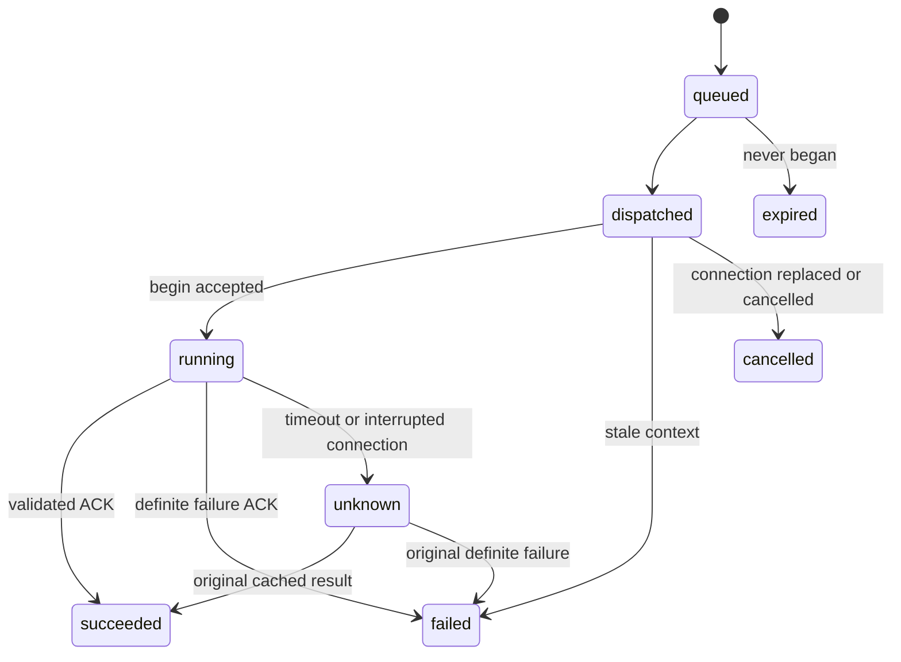

# 可选聊天组件与前端控制桥

本模块让已有系统复用聊天 UI、会话消息排队、浏览器 SDK、动作投递和回执恢复。每个系统只需接入自己的业务 API、登录身份、页面上下文与 UI handler。模块默认关闭，不修改 v1 运行库结构，原 `/runs` 和 `/admin` 的认证方式保持原样。部署范围是单节点、本地持久磁盘和 SQLite WAL。

## 运行完整示例

在仓库根目录执行 `go run ./examples/web-integration`，访问 `http://127.0.0.1:8092`。示例使用明确标注的演示订单和固定 `DecisionModel`，无需模型密钥；通过框架 REST Provider 查询实际的本地 HTTP 接口，再执行浏览器 handler，收到回执才完成任务。

- “显示待处理订单”：查询后端，再更新列表和筛选条件。
- “打开订单 1001”：批准精确参数后才打开详情。
- “体验补充信息”：先追问，再根据输入更新列表。
- 连续发送消息可观察 FIFO 排队；可以停止排队或执行中的任务。

示例只监听回环地址，身份固定为 `demo`，退出时删除临时数据库。生产环境须用宿主已经验证的登录会话解析身份，并使用真实模型、业务数据和持久存储。

## 选择要复用的模块

| 方式 | 配置 | 复用内容 |
| --- | --- | --- |
| 只加聊天框 | `chat: true`, `browser_bridge: false` | ChatService、SDK、可选组件；调用后端能力 |
| 聊天并控制页面 | 两项均为 `true` | 会话、组件、浏览器控制桥 |
| 已有聊天 UI，仅需控制桥 | `chat: false`, `browser_bridge: true` | SDK 的 `run()` 和浏览器动作 |
| 自己渲染聊天 | 按需启用服务 | SDK 事件、发送、审批、输入和取消方法 |

## 部署配置和授权

在现有 deployment JSON 增加以下片段。`records` 是已有后端包，`records-web` 是组合别名；相对路径基于 deployment 文件所在目录。

```json
{
  "web_integration": {
    "database_path": "/data/agent-web.sqlite3",
    "chat": true,
    "browser_bridge": true,
    "session_key_env": "AGENT_WEB_SESSION_KEY",
    "session_ttl_seconds": 900,
    "allowed_origins": ["https://app.example.com"],
    "integrations": {
      "records-web": {
        "pack_id": "records",
        "frontend_profile_path": "frontend-profile.json"
      }
    }
  }
}
```

`AGENT_WEB_SESSION_KEY` 是至少 32 字节的随机服务端秘密，可用 `openssl rand -hex 32` 生成。票据有效期默认 900 秒，可配置 60–3600 秒。`allowed_origins` 为不含路径的精确 HTTP(S) origin；直接同源请求自动允许。TLS 在反向代理终止时，显式配置外部 HTTPS origin。可使用同源 `/agent` 反向代理，代理去掉 `/agent` 前缀。

扩展库必须与运行库、管理库分开。备份和恢复时停止写入，同时保存各数据库和能力包，避免恢复到不一致的时间点。模块没有自动保留期清理。

对应用户增加 `"browser_actions": {"records-web": ["ui.navigate"]}`。用户仍须拥有 `users.<owner>.packs.records` 的有效连接及 `allow_model_data: true`。后端授权沿用现有配置。浏览器注册 handler 仅声明能执行的动作，服务端决定权限。Go 嵌入式服务可设置 `server.Web.ResolveBrowserActions`，实时读取宿主授权；先以 `workerEnabled=false` 构造服务器、设置 hook，再运行自己的 `Web.Tick` / `Host.WakeDue` 调度。不要在运行期间并发修改配置 map 或 hook。

仅聊天可配置 `"integrations": {"records": {"pack_id":"records"}}`，无需 profile。包含前端 profile 的 integration 必须使用独立别名，避免改变原包的能力目录。业务包不能使用保留的 `ui.*` 命名空间。

## 前端动作契约

一个最小 `frontend-profile.json`：

```json
{
  "schema": "agenstra.frontend-profile.v1",
  "version": "1.0.0",
  "handler_version": "1",
  "context_schema": {
    "type": "object",
    "properties": {"page": {"type": "string"}},
    "required": ["page"], "additionalProperties": false
  },
  "actions": [{
    "name": "ui.navigate",
    "description": "Open a supported application page",
    "input_schema": {
      "type": "object",
      "properties": {"page": {"enum": ["home", "orders"]}},
      "required": ["page"], "additionalProperties": false
    },
    "output_schema": {
      "type": "object",
      "properties": {"page": {"type": "string"}},
      "required": ["page"], "additionalProperties": false
    },
    "effect": "write", "approval_required": false, "timeout_seconds": 60
  }]
}
```

动作使用 `ui.*` 名称，输入输出须为 object Schema；effect 为 `read`、`write` 或 `destructive`，超时 1–300 秒，默认 60。审批由 profile 或实时 policy 的 `ApprovalCapabilities` 要求。`ui.get_context`、`ui.command_status` 保留给框架。上下文最多 16 KiB，结果最多 64 KiB。

profile 由服务端发布，在线浏览器不能新增模型可用能力。组合 release 固定前端 profile 和后端 fingerprint。托管后端恢复不可变 release；静态后端契约或绑定发生变更时，旧组合 run 在执行前以 `web_base_contract_changed` 拒绝，不能静默接受新契约。新任务使用新版本。别名不能改绑到其他业务包，改绑时使用新别名。

handler 语义变化时更新 `handler_version` 和 profile 版本。注册版本必须匹配当前 profile；旧 run 保留原契约。页面重载不会将未确认的旧动作迁移到新 generation。

## 用宿主登录身份换短期票据

浏览器仅接收短期 web ticket，不接收长期 API key 或管理密钥。推荐宿主提供 `/api/agent-session`：验证现有 cookie/session 和宿主 CSRF，映射 Agenstra owner，在服务端用该用户的 API key 调用 `POST /web/v1/token`，仅返回 `{token, expires_at}`。

同一 Go 服务中也可设置 `server.Web.AuthenticateRequest`，由宿主登录中间件解析 owner。该 hook 只用于 mint ticket，不能信任浏览器自报的 user ID。`MintSession(owner)` 用于宿主已经验证身份的服务端代码。

Web ticket 只用于扩展路由以及该用户关联的聊天/浏览器 run，不能用于 `/runs`、`/admin` 或无关联的任务。浏览器会话另有随机 key，SDK 通过 `X-Agenstra-Browser-Key` 发送；key 不授予业务权限。

## 挂载 SDK 与聊天框

资源嵌入 Go 二进制，无需静态资源构建；也可将 `web/` 的 ES modules 纳入宿主 bundler。目录附 TypeScript 声明，`web/package.json` 当前为 private，未发布 npm 包。

```html
<div id="current-page">home</div>
<div id="agent-chat"></div>
<script type="module">
  import { createAgenstraClient } from "/agent/web/assets/agenstra-client.js";
  import { mountAgenstraChat } from "/agent/web/assets/agenstra-chat.js";
  const state = { page: "home" };
  const client = createAgenstraClient({
    endpoint: "/agent", integration: "records-web",
    browser: true, handlerVersion: "1",
    getSession: async () => {
      const response = await fetch("/api/agent-session", {
        method: "POST", credentials: "same-origin"
      });
      if (!response.ok) throw new Error("Login required");
      return response.json();
    },
    getContext: () => ({ ...state })
  });
  client.registerActions({
    "ui.navigate": async ({ page }, { commandId }) => {
      // Replace this with your router/store and await the actual view update.
      state.page = page;
      document.querySelector("#current-page").textContent = page;
      return { page };
    }
  });
  const view = mountAgenstraChat(document.querySelector("#agent-chat"), {
    client, title: "系统助手", locale: "zh-CN"
  });
  // After manual page/filter changes: await client.setContext(state);
  // On teardown: view.unmount(); await client.destroy();
</script>
```

React/Vue 只需在挂载生命周期调用 `mountAgenstraChat(container, {client})`，在卸载时调用 `view.unmount()`。client 由宿主掌握：组件卸载不会关闭仍被其他 UI 使用的 SDK；结束使用或切换登录用户时调用 `client.destroy()`。一个 tab 对同一 endpoint/integration 使用一个 client。默认 `sessionStorage` 保存 tab 绑定和执行回执，可传 `storage: null`；禁用存储后无法跨刷新自动恢复，服务端仍阻止重复认领。

handler 在连接前注册，返回符合 output Schema 的结果；实际业务写入须在后端再次校验权限，可用 `commandId` 作为业务幂等键。`getContext` 返回当前页面、筛选、选中项等数据，排除 cookie、token 和无关敏感数据。手动改变页面后调用 `setContext`。

仅聊天省略 browser、handlerVersion、getContext 和注册动作。仅控制桥用 `await client.run(instruction, {requestId})`，再以 `getRun()` 读取状态。自有聊天 UI 使用 `watchConversation`、`send`、`supplyInput`、`approve`、`cancelMessage`。发送失败后保留原 `clientId` 重试；SDK 错误附带 clientId，不要换 ID 自动重发同一操作。

组件支持中文/英文、Shadow DOM、IME 安全的 Enter 发送、Shift+Enter 换行、焦点和滚动保持。CSS 变量包括 `--agenstra-accent`、`--agenstra-text`、`--agenstra-muted`、`--agenstra-surface`、`--agenstra-ground`、`--agenstra-line`、`--agenstra-danger`、`--agenstra-height`。回答按安全文本和代码围栏呈现，暂不解析完整 Markdown，也不提供模型 token 流式输出；任务状态通过轮询更新。

## 执行与不确定结果

每条消息以稳定 ID 创建独立 run，有限历史作为数据提供给模型；业务数据应重新查询，不复用旧 Fact 引用。同一会话只执行一个任务，其余 FIFO 排队。绑定在 run 可被 worker 读取前持久化，模型不能选其他 tab。

模型先读取 `ui.get_context`；SDK 在执行前刷新宿主上下文。服务端 begin 检查 generation、revision、当前授权、取消状态和审批参数，只有一次认领允许执行。动作初始 receipt 只表示已接收；现有 Host 异步轮询得到实际结果，字段在 `result` 中。



SDK 执行前保存 command，执行后保存结果，再提交 ACK。ACK 丢失时重发原结果，不重跑 handler。服务端以 invocation ID 去重。刷新递增 generation，旧 queued/dispatched 动作取消，旧 running 变 unknown；原 generation 的缓存结果可确认原动作，并恢复同一个 operation。确认 ACK 后的恢复待办也会持久保留，以便重试网络和 revision 错误。

没有原结果证据时，run 停在 `needs_reconciliation`，同浏览器会话不再投递动作。组件“读取已确认的回执”只能读取已有成功/失败结果，不将人工猜测记为成功，不重执行旧动作。无法恢复时核对真实状态并停止旧任务；旧 tab 仍被 unknown 阻塞时，销毁旧 client 后建立新 session，再发明确的新任务。浏览器桥不承诺跨崩溃 exactly-once 外部副作用；后端写入仍须使用业务授权、审计与幂等机制。

## HTTP 接口

除 mint token 和静态资源外，接口使用 web ticket。浏览器会话、begin/result、命令查询、浏览器 run 和带前端绑定的消息提交还需 browser key。

| 接口 | 用途 / 请求 |
| --- | --- |
| `POST /web/v1/token` | 可信身份换短期票据 |
| `GET /web/assets/agenstra-client.js`、`agenstra-chat.js` | JS 资源 |
| `GET, POST /chat/v1/conversations` | 用户会话，创建用 `{integration_id}` |
| `GET /chat/v1/conversations/{id}` | 消息和 run 状态 |
| `POST /chat/v1/conversations/{id}/messages` | `{client_id,text,session_id}` |
| `POST /chat/v1/messages/{id}/cancel` | 取消消息 |
| `GET /browser/v1/integrations/{id}` | profile 和 digest |
| `POST /browser/v1/sessions` | `{integration_id,handler_version,handlers}` |
| `POST /browser/v1/sessions/{id}/resume`、`poll`、`close` | `{generation}` |
| `POST /browser/v1/sessions/{id}/context` | `{generation,revision,context}` |
| `POST /browser/v1/runs` | `{integration_id,session_id,instruction,request_id}` |
| `POST /browser/v1/commands/{id}/begin` | `{generation}` |
| `POST /browser/v1/commands/{id}/result` | `{generation,status,result,error_code}` |
| `GET /browser/v1/commands/{id}` | 原动作回执 |
| `POST /browser/v1/commands/{id}/reconcile` | `{revision}`，恢复已有证据 |
| `/web/v1/runs/{id}` 及 `input`、`approval`、`resume`、`cancel`、`events`、`artifacts/{id}` | 复用 run 协议，限用户关联的 run |

## 验证

```sh
go test -race ./...
go vet ./...
go build ./cmd/...
cd web
npm test
```

Go 回归覆盖消息并发、取消发布、去重、授权与审批、代际隔离、契约固定和票据范围；Node 测试覆盖 handler 不重跑、ACK 丢失、恢复重试、心跳、上下文变化及卸载。示例的固定模型验证执行协议，不评估真实模型理解任务的能力。
